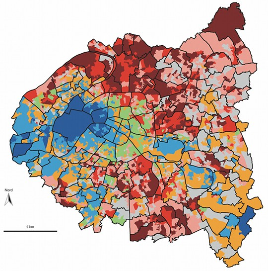
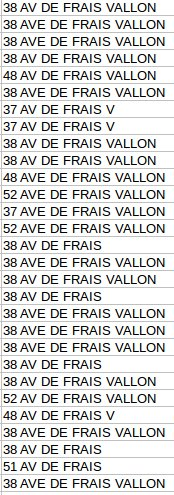

<script>
  (function(i,s,o,g,r,a,m){i['GoogleAnalyticsObject']=r;i[r]=i[r]||function(){
  (i[r].q=i[r].q||[]).push(arguments)},i[r].l=1*new Date();a=s.createElement(o),
  m=s.getElementsByTagName(o)[0];a.async=1;a.src=g;m.parentNode.insertBefore(a,m)
  })(window,document,'script','https://www.google-analytics.com/analytics.js','ga');

  ga('create', 'UA-18024542-1', 'auto');
  ga('send', 'pageview');

</script>

<script>
$(document).ready(function () {
    $('pre').css('display', 'none');
    $('pre').before('<a class="answer" href="#" style="color:orange">[montrer le code]</a>');
    $('a.answer').on('click', function (event) {
        $(this).next().show('fast');
        $(this).hide();
        event.preventDefault();
    });
});
</script>

```{r setup, include=FALSE}
library(tufte)
# invalidate cache when the tufte version changes
knitr::opts_chunk$set(tidy = FALSE, cache.extra = packageVersion('tufte'), echo = TRUE, cache = TRUE, autodep = TRUE, message = FALSE, warning = FALSE)
options(htmltools.dir.version = FALSE)
```


# Origine du projet

`r newthought("Il y a quelques temps")`, Anna Villechenon, journaliste au *Monde*, m'a contacté dans le cadre d'un reportage qu'elle préparait sur le vote FN à Marseille, particulièrement dans le secteur municipal dont Stéphane Ravier est le maire, les 13e et 14e arrondissements. Je lui expliquais que, de mon point de vue, l'une des clés de compréhension majeures du vote FN dans ce secteur repose sur l'opposition entre les "noyaux villageois" d'un côté (c'est-à-dire des zones d'habitat dense, maisons mitoyennes et petits immeubles, organisés autour de commerces et d'équipements privés ou publics, qui constituent généralement l'urbanisation la plus ancienne dans les secteurs périphériques de Marseille), et les grands ensembles `r margin_note("Sur les grands ensembles marseillais, voir [cette belle étude par Thierry Durousseau](http://www.culturecommunication.gouv.fr/Regions/Drac-Paca/Politique-et-actions-culturelles/Patrimoine-du-XXe-siecle/Les-etudes/Marseille-ensembles-et-residences-de-la-periode-1955-1975).")` (grands programmes immobiliers, privés ou publics, généralement construits entre les années 1950 et les années 1970).  Pour le dire très rapidement, les noyaux villageois, et les zones pavillonaires qui leur sont souvent attenantes, connaissent un vote pour le Front national élevé --- Stéphane Ravier revendique d'ailleurs d'être l'élu des noyaux villageois --- tandis que dans les grands ensembles l'abstention est très élevée, et le vote à gauche prédomine parmi ceux qui votent. 

En en discutant, j'ai eu envie de faire une chose à laquelle je réfléchis depuis longtemps, dans le cadre de ma thèse notamment : tenter de donner une représentation cartographique à cette réalité. Il ne s'agit pas seulement de superposer, ou juxtaposer, une carte du vote aux bureaux de vote avec un fonds de carte représentant les formes urbaines. Depuis le programme de recherche Cartelec`r margin_note("[Site du programme de recherche Cartelec.](http://www.cartelec.net)")`, on dispose du découpage des bureaux de vote d'un grand nombre de villes françaises, ce qui permet de réaliser de belles cartes au bureau de vote.

```{marginfigure}

Carte de Paris au bureau de vote, par Jean Rivière. Source : [http://www.metropolitiques.eu/Vote-et-geographie-des-inegalites.html](http://www.metropolitiques.eu/Vote-et-geographie-des-inegalites.html)

```

À partir de là, on peut facilement créer une carte interactive superposant les résultats des élections par bureau de vote, avec un fonds de carte type [OpenStreetMap](www.openstreetmap.fr). C'est ce que j'ai fait pour commencer. Je ne détaille pas ici le processus technique de cette étape, il ne présente pas de difficulté particulière, et le code R est disponible ci-dessous pour ceux qui sont intéressés. De manière générale, l'ensemble du code et des données sont disponibles sur [github](http://www.github.com/joelgombin/voteFNmarseille).

```{r loadBV}
library(dplyr)

library(rgdal)
library(rgeos)
BVCartelec <- readOGR("./data/BV_grandes_villes_2015/", "BV_grandes_villes_2015", stringsAsFactors = FALSE, verbose = FALSE)
BVCartelec@proj4string <- CRS("+init=epsg:2154")
BVCartelec <- spTransform(BVCartelec, CRS("+init=epsg:4326"))
BVMrs <- BVCartelec[BVCartelec@data$CODE %in% 13201:13216,]

communes <- readOGR("./data/", "communes-20150101-5m-metropole", stringsAsFactors = FALSE, verbose = FALSE)
marseille <- communes[communes@data$insee %in% as.character(13201:13216),]
```


```{r resultats_regionales}

library(tidyr)

reg15BV <- readr::read_csv2("./data/RG15_Bvot_T1.txt", locale = readr::locale(encoding = "ISO-8859-1"))

reg15BV <- reg15BV %>% 
  filter(CODDPT %in% "13" & CODSUBCOM %in% "055") %>% 
  select(-NOMPSN, -PREPSN, -NUMDEPCAND) %>% 
  group_by(CODDPT, CODSUBCOM, CODBURVOT, CODNUA) %>% 
  summarise(inscrits = NBRINS[1], votants = `SUM(M.NBRVOT)`[1], exprimes = `SUM(M.NBREXP)`[1], voix = sum(`SUM(V.NBRVOIX)`)) %>% 
  ungroup %>% 
  spread(CODNUA, voix) %>% 
  mutate(BUREAU = paste0("132", substr(CODBURVOT, 1, 2), "_", CODBURVOT)) %>% 
  mutate(FN = LFN / inscrits * 100,
         FN_exp = LFN / exprimes * 100)

# reg15BV %>% 
#  filter(startsWith(CODBURVOT, "13")) %>% 
#  arrange(-FN)
```

```{r cadrage_dummy, eval = FALSE}

library(leaflet)
library(tmap)
library(leafletplugins)

BVMrs <- append_data(BVMrs, reg15BV, key.shp = "BUREAU", key.data = "BUREAU")

BV1314 <- BVMrs[BVMrs@data$CODE %in% c("13213", "13214"),]

binpal <- colorBin("Blues", BV1314$FN, c(2.8, 12, 18, 22, 30.7))

bb1314 <- bb(BV1314, ext = 1)

leaflet(BV1314, width = 534) %>%
  fitBounds(bb1314[1,1], bb1314[2,1], bb1314[1,2], bb1314[2,2]) %>% 
  addProviderTiles("CartoDB.Positron",
                   group = "Positron (par défaut)") %>% 
  addProviderTiles("OpenStreetMap.BlackAndWhite",
                   group = "OSM (noir et blanc)") %>% 
  addProviderTiles("OpenTopoMap",
                   group = "OpenTopoMap") %>% 
  addTiles(group = "OSM") %>% 
  addProviderTiles("Esri.WorldImagery",
                   group = "Satellite") %>% 
  addPolygons(stroke = TRUE,
              opacity = 0.6,
              fillOpacity = 0,
              smoothFactor = 0.8,
              weight = 1,
              group = "Bureaux de vote") %>% 
  addPolygons(data = marseille, 
              stroke = TRUE, 
              opacity = 0.8, 
              fillOpacity = 0,
              smoothFactor = 0.8,
              fillColor = NULL,
              color = "black",
              weight = 2,
              group = "Arrondissements") %>% 
  addPolygons(stroke = FALSE, 
              fillOpacity = 0.5, 
              smoothFactor = 0.8, 
              color = ~binpal(FN),
              popup = ~paste0("<b>", substr(BUREAU, 4, 5), "e arrondissement, bureau n° ", substr(BUREAU, 9,10), "</b><BR><BR>Vote FN : ", round(FN, 1), " % des inscrits<BR>(", round(FN_exp, 1), " % des exprimés)"),
              group = "Vote FN"
              ) %>% 
  addMagnifyingGlass(radius = 50,
                     fixedZoom = 13,
                     fixedPosition = TRUE, 
                     latLng = c(43.325101, 5.427882),
                     group = "Loupes") %>% 
  addMagnifyingGlass(radius = 50,
                     fixedZoom = 13,
                     fixedPosition = TRUE, 
                     latLng = c(43.352412, 5.440392),
                     group = "Loupes") %>% 
  addMagnifyingGlass(radius = 50,
                     fixedZoom = 15,
                     fixedPosition = TRUE, 
                     latLng = c(43.329832, 5.419034),
                     group = "Loupes") %>% 
  addLegend("bottomleft", 
            pal = binpal, 
            values = ~FN, 
            title = "Vote FN en % des inscrits, régionales 2015",
            labFormat = labelFormat(suffix = " %")) %>% 
  addLayersControl(baseGroups = c("Positron (par défaut)", "OSM (noir et blanc)", "OpenTopoMap", "OSM", "Satellite"),
                   overlayGroups = c("Vote FN", "Bureaux de vote", "Arrondissements", "Loupes"),
                   options = layersControlOptions(collapsed = TRUE)) %>% 
  addControlFullScreen()


```

```{marginfigure}

Vote FN au premier tour des élections régionales de 2015, en % des inscrits, dans les 13e et 14e arrondissements de Marseille. Sources, outre OpenStreetMap : Ministère de l’intérieur, Cartelec. Cliquez sur le bouton en haut à gauche de la carte, en dessous du zoom, pour passer la carte en plein écran. Le fond de carte, ainsi que les couches affichées, peuvent être sélectionnés en haut à droite. Les loupes indiquent la position des quartiers mentionnés dans le reportage.

```


```{r cadrage, echo = FALSE}

library(leaflet)
library(leafletplugins)
library(tmap)

BVMrs <- append_data(BVMrs, reg15BV, key.shp = "BUREAU", key.data = "BUREAU")

BV1314 <- BVMrs[BVMrs@data$CODE %in% c("13213", "13214"),]

binpal <- colorBin("Blues", BV1314$FN, c(2.8, 12, 18, 22, 30.7))

bb1314 <- bb(BV1314, ext = 1)

leaflet(BV1314, width = 534) %>%
  fitBounds(bb1314[1,1], bb1314[2,1], bb1314[1,2], bb1314[2,2]) %>% 
  addProviderTiles("CartoDB.Positron",
                   group = "Positron (par défaut)") %>% 
  addProviderTiles("OpenStreetMap.BlackAndWhite",
                   group = "OSM (noir et blanc)") %>% 
  addProviderTiles("OpenTopoMap",
                   group = "OpenTopoMap") %>% 
  addTiles(group = "OSM") %>% 
  addProviderTiles("Esri.WorldImagery",
                   group = "Satellite") %>% 
  addPolygons(stroke = TRUE,
              opacity = 0.6,
              fillOpacity = 0,
              smoothFactor = 0.8,
              weight = 1,
              group = "Bureaux de vote") %>% 
  addPolygons(data = marseille, 
              stroke = TRUE, 
              opacity = 0.8, 
              fillOpacity = 0,
              smoothFactor = 0.8,
              fillColor = NULL,
              color = "black",
              weight = 2,
              group = "Arrondissements") %>% 
  addPolygons(stroke = FALSE, 
              fillOpacity = 0.5, 
              smoothFactor = 0.8, 
              color = ~binpal(FN),
              popup = ~paste0("<b>", substr(BUREAU, 4, 5), "e arrondissement, bureau n° ", substr(BUREAU, 9,10), "</b><BR><BR>Vote FN : ", round(FN, 1), " % des inscrits<BR>(", round(FN_exp, 1), " % des exprimés)"),
              group = "Vote FN"
              ) %>% 
  addMagnifyingGlass(radius = 50,
                     fixedZoom = 13,
                     fixedPosition = TRUE, 
                     latLng = c(43.325101, 5.427882),
                     group = "Loupes") %>% 
  addMagnifyingGlass(radius = 50,
                     fixedZoom = 13,
                     fixedPosition = TRUE, 
                     latLng = c(43.352412, 5.440392),
                     group = "Loupes") %>% 
  addMagnifyingGlass(radius = 50,
                     fixedZoom = 15,
                     fixedPosition = TRUE, 
                     latLng = c(43.329832, 5.419034),
                     group = "Loupes") %>% 
  addLegend("bottomleft", 
            pal = binpal, 
            values = ~FN, 
            title = "Vote FN en % des inscrits, régionales 2015",
            labFormat = labelFormat(suffix = " %")) %>% 
  addLayersControl(baseGroups = c("Positron (par défaut)", "OSM (noir et blanc)", "OpenTopoMap", "OSM", "Satellite"),
                   overlayGroups = c("Vote FN", "Bureaux de vote", "Arrondissements", "Loupes"),
                   options = layersControlOptions(collapsed = TRUE)) %>% 
  addControlFullScreen()


```

En explorant cette carte, notamment en utilisant en couche de fond OSM ou les photos satellite, on peut en effet constater que les bureaux qui votent le plus pour le FN correspondent souvent à des noyaux villageois ou à des zones pavillonaires. Toutefois, elle ne permet pas de communiquer directement ce message, et ne propose rien de pertinent à une échelle très fine --- celle du quartier, voire du pâté de maisons. C'est à cette préoccupation que j'ai essayé de répondre : localiser les électeurs FN quasiement à l'échelle de leur domicile. Bien sûr, le vote étant secret, ce rêve demeure inatteignable (et tant mieux !), mais on peut essayer de s'en approcher. On va le faire pour deux quartiers du 13e arrondissement : celui de Frais Vallon-la Rose-Saint-Jérôme, et celui de Château-Gombert. 


# Première étape : connaître le lien entre vote FN et types de logement

`r newthought("La première chose")` qu'on a besoin de savoir est comment sont corrélés le vote FN et le type de logement. Ou, pour le dire autrement, quelle est la proportion d'électeurs habitant en maison (resp. en appartement) qui vote FN. Rien de très compliqué à ce stade : un petit modèle linéaire devrait nous permettre d'opérer cette estimation. Cependant, deux problèmes se posent :

```{marginfigure}
Les IRIS, îlots regroupés pour la statistique publique, comprennent généralement autour de 2000 habitants et constituent le maillage le plus fin auquel l'INSEE diffuse les résultats du recensement. Pour en savoir plus, et accéder au découpage des IRIS (diffusé librement par l'IGN sous licence libre), voir [cette page](http://www.insee.fr/fr/methodes/default.asp?page=zonages/cartes-iris.htm).

```

- d'une part, les données issues du recensement et diffusées par l'INSEE concernant le logement le sont au niveau des IRIS, tandis que les données électorales sont connues au niveau des bureaux de vote.
- d'autre part, les données de l'INSEE concernant le logement porte sur une population qui n'est pas la population électorale, du point de vue notamment de l'âge et de la nationalité. On risque donc d'introduire un biais si on cherche à corréler la population recensée par l'INSEE et celle inscrite sur les listes électorales. 

## Apparier IRIS et bureaux de vote

Le premier problème est assez classique en géographique. La solution la plus standard (celle utilisée par exemple par les chercheurs de Cartelec pour produire [des données sociodémographiques par bureau de vote](http://www.cartelec.net/?page_id=3609)) consiste à identifier les intersections entre les deux maillages (bureaux de vote et IRIS), et à ventiler les données dans chacune des intersections, proportionnellement à sa surface, pour pouvoir reconstituer l'autre maillage^[Voir par exemple la section A4 du [rapport Cartelec](http://halshs.archives-ouvertes.fr/halshs-00839899) dans lequel cette procédure est décrite en détail.]. L'hypothèse clé de cette méthode est celle dite d'équirépartition : on part du principe que les électeurs/habitants sont répartis de manière homogène au sein de chaque bureau de vote ou IRIS. Or, cette hypothèse est évidemment fausse, et surtout, sur le terrain qui nous intéresse, elle est fausse de telle manière que cela risque d'introduire des biais significatifs. 


```{r electeurs, include = FALSE, echo=FALSE}
raw <- readr::read_csv2("./data/adressesetbv.csv")

library(banR) # devtools::install_github("joelgombin/banR")
library(stringr)

electeurs <- raw %>%
    filter(Adresse != "") %>%
    mutate(Bureau = stringr::str_pad(Bureau, 4, "left", "0")) %>%
    mutate(Arrondissement = stringr::str_sub(Bureau, 1, 2)) %>%
    mutate(insee = paste0("132", Arrondissement)) %>%
    mutate(AdresseOK = Adresse  %>% 
                        str_replace("[ ]*AV[E]* DE FRAIS$", " AVENUE DE FRAIS VALLON") %>% 
                        str_replace("[ ]*AV[E]* DE FRAIS V$", " AVENUE DE FRAIS VALLON") %>% 
                        str_replace("[ ]*AV[E]* DE FRAIS VA$", " AVENUE DE FRAIS VALLON") %>% 
                        str_replace("[ ]*AV[E]* DE FRAIS VAL$", " AVENUE DE FRAIS VALLON") %>% 
                        str_replace("[ ]*AV[E]* DE FRAIS VALL$", " AVENUE DE FRAIS VALLON") %>% 
                        str_replace("[ ]*AV[E]* DE FRAIS VALLO$", " AVENUE DE FRAIS VALLON") %>%
                        str_replace("[ ]*AV[E]* ", " AVENUE ") %>% 
                        str_replace("[ ]*CRS ", " COURS ") %>% 
                        str_replace("[ ]*BD ", " BOULEVARD ") %>% 
                        str_replace("[ ]*IMP ", " IMPASSE ") %>% 
                        str_replace("[ ]*TRA ", " TRAVERSE ") %>% 
                        str_replace("[ ]*MTE ", " MONTEE ") %>% 
                        str_replace("[ ]*CHE ", " CHEMIN ") %>% 
                        str_replace("[ ]*ALL ", " ALLEE ") %>% 
                        str_replace("[ ]*PAT ", " PLATEAU ")) %>%
    filter(insee %in% c("13213", "13214")) %>% 
    count(AdresseOK, insee) %>% 
    ban_geocode(AdresseOK, code_insee = "insee")

electeurs <- electeurs %>% 
  # LES VIEUX CYPRES
  mutate(latitude = ifelse(AdresseOK == " ALLEE FLOREAL", 43.336585, latitude),
         longitude = ifelse(AdresseOK == " ALLEE FLOREAL", 5.437076, longitude),
         result_score = ifelse(AdresseOK == " ALLEE FLOREAL", 1, result_score)) %>%
  mutate(latitude = ifelse(str_detect(AdresseOK, "[0-9]+ ALLEE VAL BRISE"), 43.328716, latitude),
         longitude = ifelse(str_detect(AdresseOK, "[0-9]+ ALLEE VAL BRISE"), 5.421931, longitude),
         result_score = ifelse(str_detect(AdresseOK, "[0-9]+ ALLEE VAL BRISE"), 1, result_score)) %>%
  mutate(latitude = ifelse(str_detect(AdresseOK, "[0-9]+ RUE CHNORK KALOUSTIAN"), 43.328707, latitude),
         longitude = ifelse(str_detect(AdresseOK, "[0-9]+ RUE CHNORK KALOUSTIAN"), 5.439940, longitude),
         result_score = ifelse(str_detect(AdresseOK, "[0-9]+ RUE CHNORK KALOUSTIAN"), 1, result_score)) %>%
  mutate(latitude = ifelse(str_detect(AdresseOK, "[0-9]+ AVENUE CHARLES CAMOINS"), 43.332796, latitude),
         longitude = ifelse(str_detect(AdresseOK, "[0-9]+ AVENUE CHARLES CAMOINS"), 5.410780, longitude),
         result_score = ifelse(str_detect(AdresseOK, "[0-9]+ AVENUE CHARLES CAMOINS"), 1, result_score)) %>%
  mutate(latitude = ifelse(str_detect(AdresseOK, "109 CHEMIN DE S[AIN]*TE MARTHE"), 43.324405, latitude),
         longitude = ifelse(str_detect(AdresseOK, "109 CHEMIN DE S[AIN]*TE MARTHE"), 5.388036, longitude),
         result_score = ifelse(str_detect(AdresseOK, "109 CHEMIN DE S[AIN]*TE MARTHE"), 1, result_score)) %>%
  mutate(latitude = ifelse(str_detect(AdresseOK, "119 CHEMIN DE S[AIN]*TE MARTHE"), 43.324917, latitude),
         longitude = ifelse(str_detect(AdresseOK, "119 CHEMIN DE S[AIN]*TE MARTHE"), 5.387715, longitude),
         result_score = ifelse(str_detect(AdresseOK, "119 CHEMIN DE S[AIN]*TE MARTHE"), 1, result_score)) %>%
  mutate(latitude = ifelse(str_detect(AdresseOK, "121 CHEMIN DE S[AIN]*TE MARTHE"), 43.325268, latitude),
         longitude = ifelse(str_detect(AdresseOK, "121 CHEMIN DE S[AIN]*TE MARTHE"), 5.386175, longitude),
         result_score = ifelse(str_detect(AdresseOK, "121 CHEMIN DE S[AIN]*TE MARTHE"), 1, result_score)) %>%
  mutate(latitude = ifelse(str_detect(AdresseOK, "39 BOULEVARD CHARLES MORETTI"), 43.324936, latitude),
         longitude = ifelse(str_detect(AdresseOK, "39 BOULEVARD CHARLES MORETTI"), 5.383616, longitude),
         result_score = ifelse(str_detect(AdresseOK, "39 BOULEVARD CHARLES MORETTI"), 1, result_score)) %>%
  mutate(latitude = ifelse(str_detect(AdresseOK, "41 BOULEVARD CHARLES MORETTI"), 43.324522, latitude),
         longitude = ifelse(str_detect(AdresseOK, "41 BOULEVARD CHARLES MORETTI"), 5.385125, longitude),
         result_score = ifelse(str_detect(AdresseOK, "41 BOULEVARD CHARLES MORETTI"), 1, result_score)) %>%
  mutate(latitude = ifelse(str_detect(AdresseOK, "1 AVENUE GEORGES BRAQUE"), 43.334354, latitude),
         longitude = ifelse(str_detect(AdresseOK, "1 AVENUE GEORGES BRAQUE"), 5.399891, longitude),
         result_score = ifelse(str_detect(AdresseOK, "1 AVENUE GEORGES BRAQUE"), 1, result_score)) %>%
  mutate(latitude = ifelse(str_detect(AdresseOK, "15 AVENUE GEORGES BRAQUE"), 43.333176, latitude),
         longitude = ifelse(str_detect(AdresseOK, "15 AVENUE GEORGES BRAQUE"), 5.401811, longitude),
         result_score = ifelse(str_detect(AdresseOK, "15 AVENUE GEORGES BRAQUE"), 1, result_score)) %>%
  mutate(latitude = ifelse(str_detect(AdresseOK, "27 AVENUE GEORGES BRAQUE"), 43.332788, latitude),
         longitude = ifelse(str_detect(AdresseOK, "27 AVENUE GEORGES BRAQUE"), 5.402697, longitude),
         result_score = ifelse(str_detect(AdresseOK, "27 AVENUE GEORGES BRAQUE"), 1, result_score)) %>%
  # FONT VERT
  mutate(latitude = ifelse(str_detect(AdresseOK, "206 CHEMIN DE SAINTE MARTHE"), 43.331037, latitude),
         longitude = ifelse(str_detect(AdresseOK, "206 CHEMIN DE SAINTE MARTHE"), 5.389990, longitude),
         result_score = ifelse(str_detect(AdresseOK, "206 CHEMIN DE SAINTE MARTHE"), 1, result_score)) %>%
  # LES JONQUILLES
  mutate(latitude = ifelse(str_detect(AdresseOK, "2 IMPASSE RAVEL"), 43.324459, latitude),
         longitude = ifelse(str_detect(AdresseOK, "2 IMPASSE RAVEL"), 5.429446, longitude),
         result_score = ifelse(str_detect(AdresseOK, "2 IMPASSE RAVEL"), 1, result_score)) %>%
  # FRAIS VALLON
  mutate(latitude = ifelse(str_detect(AdresseOK, "5 IMPASSE RAVEL"), 43.326335, latitude),
         longitude = ifelse(str_detect(AdresseOK, "5 IMPASSE RAVEL"), 5.430527, longitude),
         result_score = ifelse(str_detect(AdresseOK, "5 IMPASSE RAVEL"), 1, result_score)) %>%
  mutate(latitude = ifelse(str_detect(AdresseOK, "9 IMPASSE RAVEL"), 43.326322, latitude),
         longitude = ifelse(str_detect(AdresseOK, "9 IMPASSE RAVEL"), 5.429755, longitude),
         result_score = ifelse(str_detect(AdresseOK, "9 IMPASSE RAVEL"), 1, result_score)) %>%
  mutate(latitude = ifelse(str_detect(AdresseOK, "24 AVENUE DE FRAIS VALLON"), 43.324483, latitude),
         longitude = ifelse(str_detect(AdresseOK, "24 AVENUE DE FRAIS VALLON"), 5.423767, longitude),
         result_score = ifelse(str_detect(AdresseOK, "24 AVENUE DE FRAIS VALLON"), 1, result_score)) %>% 
  mutate(latitude = ifelse(str_detect(AdresseOK, "37 AVENUE DE FRAIS VALLON"), 43.325110, latitude),
         longitude = ifelse(str_detect(AdresseOK, "37 AVENUE DE FRAIS VALLON"), 5.425093, longitude),
         result_score = ifelse(str_detect(AdresseOK, "37 AVENUE DE FRAIS VALLON"), 1, result_score)) %>% 
  mutate(latitude = ifelse(str_detect(AdresseOK, "38 AVENUE DE FRAIS VALLON"), 43.324035, latitude),
         longitude = ifelse(str_detect(AdresseOK, "38 AVENUE DE FRAIS VALLON"), 5.426018, longitude),
         result_score = ifelse(str_detect(AdresseOK, "38 AVENUE DE FRAIS VALLON"), 1, result_score)) %>% 
  mutate(latitude = ifelse(str_detect(AdresseOK, "48 AVENUE DE FRAIS VALLON"), 43.324397, latitude),
         longitude = ifelse(str_detect(AdresseOK, "48 AVENUE DE FRAIS VALLON"), 5.427578, longitude),
         result_score = ifelse(str_detect(AdresseOK, "48 AVENUE DE FRAIS VALLON"), 1, result_score)) %>% 
  mutate(latitude = ifelse(str_detect(AdresseOK, "51 AVENUE DE FRAIS VALLON"), 43.326458, latitude),
         longitude = ifelse(str_detect(AdresseOK, "51 AVENUE DE FRAIS VALLON"), 5.428182, longitude),
         result_score = ifelse(str_detect(AdresseOK, "51 AVENUE DE FRAIS VALLON"), 1, result_score)) %>% 
  mutate(latitude = ifelse(str_detect(AdresseOK, "52 AVENUE DE FRAIS VALLON"), 43.324878, latitude),
         longitude = ifelse(str_detect(AdresseOK, "52 AVENUE DE FRAIS VALLON"), 5.428788, longitude),
         result_score = ifelse(str_detect(AdresseOK, "52 AVENUE DE FRAIS VALLON"), 1, result_score)) %>% 
  mutate(latitude = ifelse(str_detect(AdresseOK, "53 AVENUE DE FRAIS VALLON"), 43.325863, latitude),
         longitude = ifelse(str_detect(AdresseOK, "53 AVENUE DE FRAIS VALLON"), 5.428971, longitude),
         result_score = ifelse(str_detect(AdresseOK, "53 AVENUE DE FRAIS VALLON"), 1, result_score)) %>% 
  mutate(latitude = ifelse(str_detect(AdresseOK, "71 AVENUE DE FRAIS VALLON"), 43.325797, latitude),
         longitude = ifelse(str_detect(AdresseOK, "71 AVENUE DE FRAIS VALLON"), 5.430135, longitude),
         result_score = ifelse(str_detect(AdresseOK, "71 AVENUE DE FRAIS VALLON"), 1, result_score)) %>%
  mutate(latitude = ifelse(str_detect(AdresseOK, "84 AVENUE DE FRAIS VALLON"), 43.324959, latitude),
         longitude = ifelse(str_detect(AdresseOK, "84 AVENUE DE FRAIS VALLON"), 5.432617, longitude),
         result_score = ifelse(str_detect(AdresseOK, "84 AVENUE DE FRAIS VALLON"), 1, result_score)) %>%
  mutate(latitude = ifelse(str_detect(AdresseOK, "152 AVENUE DE FRAIS VALLON"), 43.325179, latitude),
         longitude = ifelse(str_detect(AdresseOK, "152 AVENUE DE FRAIS VALLON"), 5.432721, longitude),
         result_score = ifelse(str_detect(AdresseOK, "152 AVENUE DE FRAIS VALLON"), 1, result_score)) %>%
  mutate(latitude = ifelse(str_detect(AdresseOK, "156 AVENUE DE FRAIS VALLON"), 43.324280, latitude),
         longitude = ifelse(str_detect(AdresseOK, "156 AVENUE DE FRAIS VALLON"), 5.434116, longitude),
         result_score = ifelse(str_detect(AdresseOK, "156 AVENUE DE FRAIS VALLON"), 1, result_score)) %>%
  mutate(latitude = ifelse(str_detect(AdresseOK, "75 CHEMIN DES JONQUILLES"), 43.327818, latitude),
         longitude = ifelse(str_detect(AdresseOK, "75 CHEMIN DES JONQUILLES"), 5.431006, longitude),
         result_score = ifelse(str_detect(AdresseOK, "75 CHEMIN DES JONQUILLES"), 1, result_score)) %>%
  # LE CLOS LA ROSE
  mutate(latitude = ifelse(str_detect(AdresseOK, "35 AVENUE DE LA CROIX ROUGE"), 43.332364, latitude),
         longitude = ifelse(str_detect(AdresseOK, "35 AVENUE DE LA CROIX ROUGE"), 5.429993, longitude),
         result_score = ifelse(str_detect(AdresseOK, "35 AVENUE DE LA CROIX ROUGE"), 1, result_score)) %>%
  # LA BEGUDE
  mutate(latitude = ifelse(str_detect(AdresseOK, "98 AVENUE DE LA CROIX ROUGE"), 43.332992, latitude),
         longitude = ifelse(str_detect(AdresseOK, "98 AVENUE DE LA CROIX ROUGE"), 5.442203, longitude),
         result_score = ifelse(str_detect(AdresseOK, "98 AVENUE DE LA CROIX ROUGE"), 1, result_score)) %>%
  mutate(latitude = ifelse(str_detect(AdresseOK, "2 RUE MARIUS DIOULOUFET"), 43.333726, latitude),
         longitude = ifelse(str_detect(AdresseOK, "2 RUE MARIUS DIOULOUFET"), 5.439092, longitude),
         result_score = ifelse(str_detect(AdresseOK, "2 RUE MARIUS DIOULOUFET"), 1, result_score)) %>%
  # PARC DE LA ROSE 
  mutate(latitude = ifelse(str_detect(AdresseOK, "120 AVENUE JEAN PAUL SARTRE"), 43.326782, latitude),
         longitude = ifelse(str_detect(AdresseOK, "120 AVENUE JEAN PAUL SARTRE"), 5.426009, longitude),
         result_score = ifelse(str_detect(AdresseOK, "120 AVENUE JEAN PAUL SARTRE"), 1, result_score)) %>%
  mutate(latitude = ifelse(str_detect(AdresseOK, "11 IMPASSE DE LA FARANDOLE"), 43.327192, latitude),
         longitude = ifelse(str_detect(AdresseOK, "11 IMPASSE DE LA FARANDOLE"), 5.425219, longitude),
         result_score = ifelse(str_detect(AdresseOK, "11 IMPASSE DE LA FARANDOLE"), 1, result_score)) %>%  
  # CHATEAU BELMONT
  mutate(latitude = ifelse(str_detect(AdresseOK, "49 TRAVERSE DES BONNETS"), 43.331645, latitude),
         longitude = ifelse(str_detect(AdresseOK, "49 TRAVERSE DES BONNETS"), 5.423349, longitude),
         result_score = ifelse(str_detect(AdresseOK, "49 TRAVERSE DES BONNETS"), 1, result_score)) %>%  
  # GROUPE LA GARDE
  mutate(latitude = ifelse(str_detect(AdresseOK, "11 BOULEVARD DU METRO"), 43.332089, latitude),
         longitude = ifelse(str_detect(AdresseOK, "11 BOULEVARD DU METRO"), 5.428202, longitude),
         result_score = ifelse(str_detect(AdresseOK, "11 BOULEVARD DU METRO"), 1, result_score)) %>%  
  # # HAMEAU VAL DE GRAY
  # mutate(latitude = ifelse(str_detect(AdresseOK, "77 BOULEVARD BARA"), 43.332089, latitude),
  #        longitude = ifelse(str_detect(AdresseOK, "11 BOULEVARD DU METRO"), 5.428202, longitude),
  #        result_score = ifelse(str_detect(AdresseOK, "11 BOULEVARD DU METRO"), 1, result_score)) %>%  
  
  filter(result_score > 0.45) %>% 
  group_by(result_label) %>% 
  mutate(n = sum(n)) %>% 
  distinct(result_label, .keep_all = TRUE)

electeurs <- SpatialPointsDataFrame(as.data.frame(electeurs[, c("longitude", "latitude")]), as.data.frame(electeurs), proj4string = CRS("+init=epsg:4326"))

electeurs@data <- cbind(electeurs@data, over(electeurs, BVMrs))
```

```{r bureau_1375, fig.margin = TRUE, fig.cap = "Électeurs géolocalisés à l'adresse dans le bureau n° 1375 de Marseille. On voit que leur répartition est loin d'être homogène."}

b1375_raster <- read_osm(bb(BVMrs[BVMrs@data$BUREAU %in% "13213_1375",]), raster = TRUE, type = "osm")

tm_shape(b1375_raster) +
  tm_raster() +
tm_shape(BVMrs[BVMrs@data$BUREAU %in% "13213_1375",]) +
  tm_polygons(alpha = 0, border.col = "blue", lwd = 2) +
tm_shape(electeurs[electeurs@data$BUREAU %in% "13213_1375",]) +
  tm_bubbles(size = "n", col = "black", perceptual = TRUE, legend.size.is.portrait = TRUE, title.size = "Nombre d'électeurs") +
tm_legend(position = c("left", "bottom"), scale = 1.5)

```

Pour pallier ce problème, j'ai mis au point (ça existe sans doute déjà par ailleurs, mais je n'en ai pas particulièrement trouvé de trace) une méthode permettant de ventiler les données d'un découpage à l'autre en prenant en compte la localisation effective des individus (ici, des électeurs/habitants), lorsqu'elle est connue. Or, nous la connaissons puisqu'on dispose des listes électorales, sur lesquelles figure l'adresse de chaque électeur. On peut donc à partir de ces données (géolocalisation des électeurs, résultats électoraux par bureaux de vote) reconstituer avec un bon degré de précision les résultats électoraux par IRIS (ou inversement, mais je pense qu'il est préférable de procéder dans ce sens, car les IRIS sont des découpages à la fois plus stables dans le temps et plus cohérents sociologiquement que les bureaux de vote). 

Concrètement, on commence par géolocaliser les adresses figurant sur la liste électorale marseillaise^[Le statut juridique des listes électorales n'étant pas très clair, je ne peux diffuser ici les listes brutes telles que communiquées par le bureau des élections de la ville. Le fichier utilisé est une agrégation du fichier brut, chaque ligne comprenant une adresse unique et le nombre d'électeurs qui y sont domiciliés.]. J'utilise pour cela un petit package, [`banR`](http://www.github.com/joelgombin/banR), que nous avons créé avec [Paul-Antoine Chevalier](https://github.com/pachevalier) et qui n'est rien d'autre qu'un client pour [l'API de la Base Adresse Nationale](https://adresse.data.gouv.fr/api/)`r margin_note("La Base Adresse Nationale est le résultat d'une collaboration entre l'État, la Poste, l'IGN et OpenStreetMap, notamment. Elle vise à créer un référentiel national ouvert des adresses françaises. OpenStreetMap en diffuse notamment [une version sous licence ODbL](http://openstreetmap.fr/ban).")`. Il y a aussi (voir dans le code ci-dessous) pas mal de travail de nettoyage des adresses de la liste électorale marseillaise (pas très normalisées !) et de correction de la géolocalisation (pour des raisons que j'expliquerai plus tard.)

```{r adresses_pas_normalisees, echo=FALSE, out.width=250}

```

```{r electeurs_bis, eval=FALSE}
raw <- readr::read_csv2("./data/adressesetbv.csv")

library(banR) # devtools::install_github("joelgombin/banR")
library(stringr)

electeurs <- raw %>%
    filter(Adresse != "") %>%
    mutate(Bureau = stringr::str_pad(Bureau, 4, "left", "0")) %>%
    mutate(Arrondissement = stringr::str_sub(Bureau, 1, 2)) %>%
    mutate(insee = paste0("132", Arrondissement)) %>%
    mutate(AdresseOK = Adresse  %>% 
                        str_replace("[ ]*AV[E]* DE FRAIS$", " AVENUE DE FRAIS VALLON") %>% 
                        str_replace("[ ]*AV[E]* DE FRAIS V$", " AVENUE DE FRAIS VALLON") %>% 
                        str_replace("[ ]*AV[E]* DE FRAIS VA$", " AVENUE DE FRAIS VALLON") %>% 
                        str_replace("[ ]*AV[E]* DE FRAIS VAL$", " AVENUE DE FRAIS VALLON") %>% 
                        str_replace("[ ]*AV[E]* DE FRAIS VALL$", " AVENUE DE FRAIS VALLON") %>% 
                        str_replace("[ ]*AV[E]* DE FRAIS VALLO$", " AVENUE DE FRAIS VALLON") %>%
                        str_replace("[ ]*AV[E]* ", " AVENUE ") %>% 
                        str_replace("[ ]*CRS ", " COURS ") %>% 
                        str_replace("[ ]*BD ", " BOULEVARD ") %>% 
                        str_replace("[ ]*IMP ", " IMPASSE ") %>% 
                        str_replace("[ ]*TRA ", " TRAVERSE ") %>% 
                        str_replace("[ ]*MTE ", " MONTEE ") %>% 
                        str_replace("[ ]*CHE ", " CHEMIN ") %>% 
                        str_replace("[ ]*ALL ", " ALLEE ") %>% 
                        str_replace("[ ]*PAT ", " PLATEAU ")) %>%
    filter(insee %in% c("13213", "13214")) %>% 
    count(AdresseOK, Bureau, insee) %>% 
    ban_geocode(AdresseOK, code_insee = "insee")

electeurs <- electeurs %>% 
  # LES VIEUX CYPRES
  mutate(latitude = ifelse(AdresseOK == " ALLEE FLOREAL", 43.336585, latitude),
         longitude = ifelse(AdresseOK == " ALLEE FLOREAL", 5.437076, longitude),
         result_score = ifelse(AdresseOK == " ALLEE FLOREAL", 1, result_score)) %>%
  mutate(latitude = ifelse(str_detect(AdresseOK, "[0-9]+ ALLEE VAL BRISE"), 43.328716, latitude),
         longitude = ifelse(str_detect(AdresseOK, "[0-9]+ ALLEE VAL BRISE"), 5.421931, longitude),
         result_score = ifelse(str_detect(AdresseOK, "[0-9]+ ALLEE VAL BRISE"), 1, result_score)) %>%
  mutate(latitude = ifelse(str_detect(AdresseOK, "[0-9]+ RUE CHNORK KALOUSTIAN"), 43.328707, latitude),
         longitude = ifelse(str_detect(AdresseOK, "[0-9]+ RUE CHNORK KALOUSTIAN"), 5.439940, longitude),
         result_score = ifelse(str_detect(AdresseOK, "[0-9]+ RUE CHNORK KALOUSTIAN"), 1, result_score)) %>%
  mutate(latitude = ifelse(str_detect(AdresseOK, "[0-9]+ AVENUE CHARLES CAMOINS"), 43.332796, latitude),
         longitude = ifelse(str_detect(AdresseOK, "[0-9]+ AVENUE CHARLES CAMOINS"), 5.410780, longitude),
         result_score = ifelse(str_detect(AdresseOK, "[0-9]+ AVENUE CHARLES CAMOINS"), 1, result_score)) %>%
  mutate(latitude = ifelse(str_detect(AdresseOK, "109 CHEMIN DE S[AIN]*TE MARTHE"), 43.324405, latitude),
         longitude = ifelse(str_detect(AdresseOK, "109 CHEMIN DE S[AIN]*TE MARTHE"), 5.388036, longitude),
         result_score = ifelse(str_detect(AdresseOK, "109 CHEMIN DE S[AIN]*TE MARTHE"), 1, result_score)) %>%
  mutate(latitude = ifelse(str_detect(AdresseOK, "119 CHEMIN DE S[AIN]*TE MARTHE"), 43.324917, latitude),
         longitude = ifelse(str_detect(AdresseOK, "119 CHEMIN DE S[AIN]*TE MARTHE"), 5.387715, longitude),
         result_score = ifelse(str_detect(AdresseOK, "119 CHEMIN DE S[AIN]*TE MARTHE"), 1, result_score)) %>%
  mutate(latitude = ifelse(str_detect(AdresseOK, "121 CHEMIN DE S[AIN]*TE MARTHE"), 43.325268, latitude),
         longitude = ifelse(str_detect(AdresseOK, "121 CHEMIN DE S[AIN]*TE MARTHE"), 5.386175, longitude),
         result_score = ifelse(str_detect(AdresseOK, "121 CHEMIN DE S[AIN]*TE MARTHE"), 1, result_score)) %>%
  mutate(latitude = ifelse(str_detect(AdresseOK, "39 BOULEVARD CHARLES MORETTI"), 43.324936, latitude),
         longitude = ifelse(str_detect(AdresseOK, "39 BOULEVARD CHARLES MORETTI"), 5.383616, longitude),
         result_score = ifelse(str_detect(AdresseOK, "39 BOULEVARD CHARLES MORETTI"), 1, result_score)) %>%
  mutate(latitude = ifelse(str_detect(AdresseOK, "41 BOULEVARD CHARLES MORETTI"), 43.324522, latitude),
         longitude = ifelse(str_detect(AdresseOK, "41 BOULEVARD CHARLES MORETTI"), 5.385125, longitude),
         result_score = ifelse(str_detect(AdresseOK, "41 BOULEVARD CHARLES MORETTI"), 1, result_score)) %>%
  mutate(latitude = ifelse(str_detect(AdresseOK, "1 AVENUE GEORGES BRAQUE"), 43.334354, latitude),
         longitude = ifelse(str_detect(AdresseOK, "1 AVENUE GEORGES BRAQUE"), 5.399891, longitude),
         result_score = ifelse(str_detect(AdresseOK, "1 AVENUE GEORGES BRAQUE"), 1, result_score)) %>%
  mutate(latitude = ifelse(str_detect(AdresseOK, "15 AVENUE GEORGES BRAQUE"), 43.333176, latitude),
         longitude = ifelse(str_detect(AdresseOK, "15 AVENUE GEORGES BRAQUE"), 5.401811, longitude),
         result_score = ifelse(str_detect(AdresseOK, "15 AVENUE GEORGES BRAQUE"), 1, result_score)) %>%
  mutate(latitude = ifelse(str_detect(AdresseOK, "27 AVENUE GEORGES BRAQUE"), 43.332788, latitude),
         longitude = ifelse(str_detect(AdresseOK, "27 AVENUE GEORGES BRAQUE"), 5.402697, longitude),
         result_score = ifelse(str_detect(AdresseOK, "27 AVENUE GEORGES BRAQUE"), 1, result_score)) %>%
  # FONT VERT
  mutate(latitude = ifelse(str_detect(AdresseOK, "206 CHEMIN DE SAINTE MARTHE"), 43.331037, latitude),
         longitude = ifelse(str_detect(AdresseOK, "206 CHEMIN DE SAINTE MARTHE"), 5.389990, longitude),
         result_score = ifelse(str_detect(AdresseOK, "206 CHEMIN DE SAINTE MARTHE"), 1, result_score)) %>%
  # LES JONQUILLES
  mutate(latitude = ifelse(str_detect(AdresseOK, "2 IMPASSE RAVEL"), 43.324459, latitude),
         longitude = ifelse(str_detect(AdresseOK, "2 IMPASSE RAVEL"), 5.429446, longitude),
         result_score = ifelse(str_detect(AdresseOK, "2 IMPASSE RAVEL"), 1, result_score)) %>%
  # FRAIS VALLON
  mutate(latitude = ifelse(str_detect(AdresseOK, "5 IMPASSE RAVEL"), 43.326335, latitude),
         longitude = ifelse(str_detect(AdresseOK, "5 IMPASSE RAVEL"), 5.430527, longitude),
         result_score = ifelse(str_detect(AdresseOK, "5 IMPASSE RAVEL"), 1, result_score)) %>%
  mutate(latitude = ifelse(str_detect(AdresseOK, "9 IMPASSE RAVEL"), 43.326322, latitude),
         longitude = ifelse(str_detect(AdresseOK, "9 IMPASSE RAVEL"), 5.429755, longitude),
         result_score = ifelse(str_detect(AdresseOK, "9 IMPASSE RAVEL"), 1, result_score)) %>%
  mutate(latitude = ifelse(str_detect(AdresseOK, "24 AVENUE DE FRAIS VALLON"), 43.324483, latitude),
         longitude = ifelse(str_detect(AdresseOK, "24 AVENUE DE FRAIS VALLON"), 5.423767, longitude),
         result_score = ifelse(str_detect(AdresseOK, "24 AVENUE DE FRAIS VALLON"), 1, result_score)) %>% 
  mutate(latitude = ifelse(str_detect(AdresseOK, "37 AVENUE DE FRAIS VALLON"), 43.325110, latitude),
         longitude = ifelse(str_detect(AdresseOK, "37 AVENUE DE FRAIS VALLON"), 5.425093, longitude),
         result_score = ifelse(str_detect(AdresseOK, "37 AVENUE DE FRAIS VALLON"), 1, result_score)) %>% 
  mutate(latitude = ifelse(str_detect(AdresseOK, "38 AVENUE DE FRAIS VALLON"), 43.324035, latitude),
         longitude = ifelse(str_detect(AdresseOK, "38 AVENUE DE FRAIS VALLON"), 5.426018, longitude),
         result_score = ifelse(str_detect(AdresseOK, "38 AVENUE DE FRAIS VALLON"), 1, result_score)) %>% 
  mutate(latitude = ifelse(str_detect(AdresseOK, "48 AVENUE DE FRAIS VALLON"), 43.324397, latitude),
         longitude = ifelse(str_detect(AdresseOK, "48 AVENUE DE FRAIS VALLON"), 5.427578, longitude),
         result_score = ifelse(str_detect(AdresseOK, "48 AVENUE DE FRAIS VALLON"), 1, result_score)) %>% 
  mutate(latitude = ifelse(str_detect(AdresseOK, "51 AVENUE DE FRAIS VALLON"), 43.326458, latitude),
         longitude = ifelse(str_detect(AdresseOK, "51 AVENUE DE FRAIS VALLON"), 5.428182, longitude),
         result_score = ifelse(str_detect(AdresseOK, "51 AVENUE DE FRAIS VALLON"), 1, result_score)) %>% 
  mutate(latitude = ifelse(str_detect(AdresseOK, "52 AVENUE DE FRAIS VALLON"), 43.324878, latitude),
         longitude = ifelse(str_detect(AdresseOK, "52 AVENUE DE FRAIS VALLON"), 5.428788, longitude),
         result_score = ifelse(str_detect(AdresseOK, "52 AVENUE DE FRAIS VALLON"), 1, result_score)) %>% 
  mutate(latitude = ifelse(str_detect(AdresseOK, "53 AVENUE DE FRAIS VALLON"), 43.325863, latitude),
         longitude = ifelse(str_detect(AdresseOK, "53 AVENUE DE FRAIS VALLON"), 5.428971, longitude),
         result_score = ifelse(str_detect(AdresseOK, "53 AVENUE DE FRAIS VALLON"), 1, result_score)) %>% 
  mutate(latitude = ifelse(str_detect(AdresseOK, "71 AVENUE DE FRAIS VALLON"), 43.325797, latitude),
         longitude = ifelse(str_detect(AdresseOK, "71 AVENUE DE FRAIS VALLON"), 5.430135, longitude),
         result_score = ifelse(str_detect(AdresseOK, "71 AVENUE DE FRAIS VALLON"), 1, result_score)) %>%
  mutate(latitude = ifelse(str_detect(AdresseOK, "84 AVENUE DE FRAIS VALLON"), 43.324959, latitude),
         longitude = ifelse(str_detect(AdresseOK, "84 AVENUE DE FRAIS VALLON"), 5.432617, longitude),
         result_score = ifelse(str_detect(AdresseOK, "84 AVENUE DE FRAIS VALLON"), 1, result_score)) %>%
  mutate(latitude = ifelse(str_detect(AdresseOK, "152 AVENUE DE FRAIS VALLON"), 43.325179, latitude),
         longitude = ifelse(str_detect(AdresseOK, "152 AVENUE DE FRAIS VALLON"), 5.432721, longitude),
         result_score = ifelse(str_detect(AdresseOK, "152 AVENUE DE FRAIS VALLON"), 1, result_score)) %>%
  mutate(latitude = ifelse(str_detect(AdresseOK, "156 AVENUE DE FRAIS VALLON"), 43.324280, latitude),
         longitude = ifelse(str_detect(AdresseOK, "156 AVENUE DE FRAIS VALLON"), 5.434116, longitude),
         result_score = ifelse(str_detect(AdresseOK, "156 AVENUE DE FRAIS VALLON"), 1, result_score)) %>%
  mutate(latitude = ifelse(str_detect(AdresseOK, "75 CHEMIN DES JONQUILLES"), 43.327818, latitude),
         longitude = ifelse(str_detect(AdresseOK, "75 CHEMIN DES JONQUILLES"), 5.431006, longitude),
         result_score = ifelse(str_detect(AdresseOK, "75 CHEMIN DES JONQUILLES"), 1, result_score)) %>%
  # LE CLOS LA ROSE
  mutate(latitude = ifelse(str_detect(AdresseOK, "35 AVENUE DE LA CROIX ROUGE"), 43.332364, latitude),
         longitude = ifelse(str_detect(AdresseOK, "35 AVENUE DE LA CROIX ROUGE"), 5.429993, longitude),
         result_score = ifelse(str_detect(AdresseOK, "35 AVENUE DE LA CROIX ROUGE"), 1, result_score)) %>%
  # LA BEGUDE
  mutate(latitude = ifelse(str_detect(AdresseOK, "98 AVENUE DE LA CROIX ROUGE"), 43.332992, latitude),
         longitude = ifelse(str_detect(AdresseOK, "98 AVENUE DE LA CROIX ROUGE"), 5.442203, longitude),
         result_score = ifelse(str_detect(AdresseOK, "98 AVENUE DE LA CROIX ROUGE"), 1, result_score)) %>%
  mutate(latitude = ifelse(str_detect(AdresseOK, "2 RUE MARIUS DIOULOUFET"), 43.333726, latitude),
         longitude = ifelse(str_detect(AdresseOK, "2 RUE MARIUS DIOULOUFET"), 5.439092, longitude),
         result_score = ifelse(str_detect(AdresseOK, "2 RUE MARIUS DIOULOUFET"), 1, result_score)) %>%
  # PARC DE LA ROSE 
  mutate(latitude = ifelse(str_detect(AdresseOK, "120 AVENUE JEAN PAUL SARTRE"), 43.326782, latitude),
         longitude = ifelse(str_detect(AdresseOK, "120 AVENUE JEAN PAUL SARTRE"), 5.426009, longitude),
         result_score = ifelse(str_detect(AdresseOK, "120 AVENUE JEAN PAUL SARTRE"), 1, result_score)) %>%
  mutate(latitude = ifelse(str_detect(AdresseOK, "11 IMPASSE DE LA FARANDOLE"), 43.327192, latitude),
         longitude = ifelse(str_detect(AdresseOK, "11 IMPASSE DE LA FARANDOLE"), 5.425219, longitude),
         result_score = ifelse(str_detect(AdresseOK, "11 IMPASSE DE LA FARANDOLE"), 1, result_score)) %>%  
  # CHATEAU BELMONT
  mutate(latitude = ifelse(str_detect(AdresseOK, "49 TRAVERSE DES BONNETS"), 43.331645, latitude),
         longitude = ifelse(str_detect(AdresseOK, "49 TRAVERSE DES BONNETS"), 5.423349, longitude),
         result_score = ifelse(str_detect(AdresseOK, "49 TRAVERSE DES BONNETS"), 1, result_score)) %>%  
  # GROUPE LA GARDE
  mutate(latitude = ifelse(str_detect(AdresseOK, "11 BOULEVARD DU METRO"), 43.332089, latitude),
         longitude = ifelse(str_detect(AdresseOK, "11 BOULEVARD DU METRO"), 5.428202, longitude),
         result_score = ifelse(str_detect(AdresseOK, "11 BOULEVARD DU METRO"), 1, result_score)) %>%  
  # # HAMEAU VAL DE GRAY
  # mutate(latitude = ifelse(str_detect(AdresseOK, "77 BOULEVARD BARA"), 43.332089, latitude),
  #        longitude = ifelse(str_detect(AdresseOK, "11 BOULEVARD DU METRO"), 5.428202, longitude),
  #        result_score = ifelse(str_detect(AdresseOK, "11 BOULEVARD DU METRO"), 1, result_score)) %>%  
  
  filter(result_score > 0.45) %>% 
  group_by(result_label) %>% 
  mutate(n = sum(n)) %>% 
  distinct(result_label, .keep_all = TRUE)

electeurs <- SpatialPointsDataFrame(as.data.frame(electeurs[, c("longitude", "latitude")]), as.data.frame(electeurs), proj4string = CRS("+init=epsg:4326"))

electeurs@data <- cbind(electeurs@data, over(electeurs, BVMrs)) # permet de savoir à quel BV appartient chaque adresse identifiée
```


On peut dès lors utiliser ces adresses d'électeurs géolocalisées pour pondérer la ventilation des données électorales des bureaux de vote vers les IRIS. J'utilise pour cela un petit package que j'ai rédigé, [`spReapportion`](https://github.com/joelgombin/spReapportion) (je n'en ai pas encore fait la promo car il faut encore que je le documente mieux). 

```{r ventilation}
IRIS13 <- readOGR("./data/iris/", "CONTOURS-IRIS_D013", stringsAsFactors = FALSE, verbose = FALSE)
IRIS13 <- spTransform(IRIS13, CRS("+init=epsg:4326"))


library(spReapportion) # devtools::install_github("joelgombin/spReapportion")

IRIS1314 <- IRIS13[substr(IRIS13@data$DCOMIRIS, 1, 5) %in% c("13213", "13214"),]
votes_IRIS <- spReapportion(old_geom = BV1314, 
                            new_geom = IRIS1314, 
                            data = BV1314@data, 
                            old_ID = "BUREAU", 
                            new_ID = "DCOMIRIS", 
                            data_ID = "BUREAU", 
                            variables = c("inscrits", "votants", "exprimes", "LDIV", "LDLF", "LDVG", "LECO", "LEXD", "LEXG", "LFN", "LUD", "LUG", "LVEG"), 
                            mode = "count", 
                            weight_matrix = electeurs,
                            weight_matrix_var = "n")

IRIS1314 <- append_data(IRIS1314, votes_IRIS, "DCOMIRIS", "DCOMIRIS")
IRIS1314@data$FN_ins <- IRIS1314@data$LFN / IRIS1314@data$inscrits * 100
IRIS1314@data$FN_exp <- IRIS1314@data$LFN / IRIS1314@data$exprimes * 100

```


## Estimer des données du recensement proches de la population électorale

S'agissant du deuxième problème --- les données tabulées diffusées par l'INSEE portent sur une population assez différente de celle qui est inscrite sur les listes électorales ---, il ne peut être entièrement résolu, mais on peut faire bien mieux que simplement reprendre les tabulations de l'INSEE. Pour cela, on repart des fichiers détail du recensement`r margin_note("Les [fichiers détail](http://www.insee.fr/fr/bases-de-donnees/fichiers-detail.asp) comportent un enregistrement par personne enquêtée : c'est en quelque sorte le fichier brut. Ils sont diffusés librement par l'INSEE, et offrent des possibilités énormes de retabulation à volonté. Par contre, oubliez Excel : ils font plusieurs millions de lignes...")`, et en particulier du fichier dit "Individus localisés au canton-ou-ville" dans lequel, paradoxalement, la plupart des individus sont localisés à l'IRIS. On met ces données dans une base de données MonetDB (une [base de données SQL orientée colonnes](https://fr.wikipedia.org/wiki/Base_de_donn%C3%A9es_orient%C3%A9e_colonnes) [extrêmement rapide](http://www.asdfree.com/2016/06/monetdblite-because-fast.html)), qu'on peut dès lors interroger à travers l'excellente interface du package [`dplyr`](www.github.com/hadley/dplyr) avec les [bases de données SQL](https://cran.r-project.org/web/packages/dplyr/vignettes/databases.html). 

```{r creation_base, eval = FALSE}
# création de la base de données du fichier détail du recensement, si n'existe pas
library(DBI)
library(MonetDB.R)
library(MonetDBLite)

library(Insee2MonetDB) # devtools::install_github("joelgombin/Insee2MonetDB")

if (!dir.exists("~/monetdb")) {
  dir.create("~/monetdb")
}
mdb <- dbConnect(MonetDB.R(), embedded = "~/monetdb")

path <- normalizePath("./data/bdd.zip")
downloader::download("http://telechargement.insee.fr/fichiersdetail/RP2012/txt/RP2012_INDCVIze_txt.zip", destfile = path)
unzip(path, unzip = "unzip", exdir = "./data/", junkpaths = TRUE)

# la version diffusée par l'INSEE utilise ',' comme séparateur décimal, on a besoin de "." :
system("tr ',' '.' <./data/FD_INDCVIZE_2012.txt >./data/FD_INDCVIZE_2012.txt2")  # pas sûr que cela marche sous tous les OS ?
try(invisible(dbSendQuery(mdb, "DROP TABLE rp_indcvi_2012")), silent=TRUE)
guess <- read.csv(normalizePath("./data/FD_INDCVIZE_2012.txt2"), sep = ";", stringsAsFactors=FALSE, nrows=10000)

create <- sprintf("CREATE TABLE rp_indcvi_2012 ( %s )", 
                  paste0(sprintf('"%s" %s', tolower(colnames(guess)), 
                                 sapply(guess, dbDataType, dbObj=mdb)), collapse=","))

create <- gsub('INTEGER', 'STRING', create, fixed = TRUE)

invisible(dbSendQuery(mdb, create))

invisible(dbSendQuery(mdb, paste0("COPY OFFSET 2 
                                 INTO rp_indcvi_2012
                                 FROM '", normalizePath("./data/FD_INDCVIZE_2012.txt2"), "' USING  DELIMITERS ';'")))


```

À partir de là, on retabule, par IRIS, le nombre de personnes qui habitent en maison ou en appartement, parmi les individus (1) français, (2) âgés de plus de 18 ans. Cela ne permet toutefois pas de contrôler par la non-inscription ; on pourrait éventuellement essayer de redresser les données en s'appuyant sur les résultats de [l'enquête participation](http://www.insee.fr/fr/methodes/default.asp?page=sources/ope-enq-participation-electorale.htm), mais cela semble être beaucoup d'efforts pour des résultats sans doute très peu sensiblement modifiés. 

```{r collectif_et_individuel, message=TRUE, warning=TRUE}


library(MonetDBLite)


conn <- src_monetdb(embedded = "~/monetdb")

rp2012cvi <- tbl(conn, from = "rp_indcvi_2012")

modalites <- read.table("./data/MOD_INDCVI_2012ok.txt", header = TRUE, sep = ";", stringsAsFactors = FALSE)

relabel <- function(df, modalites, variable, VAR_CODE = "VAR_CODE", VAR_LIB = "VAR_LIB", MOD_LIB = "MOD_LIB", MOD_CODE = "MOD_CODE") {
  df[, unique(modalites[tolower(modalites[[VAR_CODE]]) %in% tolower(variable), VAR_LIB])] <-  modalites[tolower(modalites[[VAR_CODE]]) %in% tolower(variable), MOD_LIB][match(df[[variable]], modalites[tolower(modalites[[VAR_CODE]]) %in% tolower(variable), MOD_CODE])]
  return(df)
}


logements1314 <- rp2012cvi %>%
  filter(inatc == "1") %>% 
  filter(as.integer(agerev) > 17) %>% 
  filter(dept == "13") %>% 
  select(iris, cantville, nummi, catl, hlml, typl) %>% 
  collect(n = Inf) %>% 
  filter(grepl("1321[34][0-9]{4}", iris)) %>%
  relabel(modalites, "typl") %>% 
  group_by(iris, `Type de logement`) %>% 
  summarise(n = n()) %>% 
  spread(`Type de logement`, n, fill = 0) %>% 
  mutate(Logements = Appartement + Maison) %>% 
  mutate_each(funs(. / Logements * 100), Appartement, Maison) %>% 
  ungroup

```

## Corréler type de logement et vote FN

À partir de là, on peut procéder à une estimation du vote FN en fonction du type de logement. Pour simplifier, on ne s'intéresse qu'aux maisons et aux appartements, qui représentent la quasi-totalité des logements dans le territoire considéré. Pour procéder à cette estimation, on construit un modèle linéaire dont le vote FN est la variable dépendante et dont la proportion d'habitants en maison et en appartement sont les deux variables indépendantes, en prenant bien garde à ne pas avoir d'ordonnée à l'origine (sinon impossible d'estimer le modèle !).

```{r modeles}

library(sjPlot)
library(sjmisc)


df <- votes_IRIS %>% 
  left_join(logements1314, by = c("DCOMIRIS" = "iris")) %>% 
  mutate(FN = LFN / inscrits * 100)
mod1 <- votes_IRIS %>% 
  left_join(logements1314, by = c("DCOMIRIS" = "iris")) %>% 
  mutate(FN = LFN / inscrits * 100) %>% 
  lm(FN ~ 0 + Appartement + Maison, data = .)

# rajouter résultats de la régression ? avec texreg par exemple


# Appartement = 0.13
# Maison = 0.31

# Mais : regarder aussi les résidus. + 10 dans l'iris 13210102 à Château-Gombert, -9.5 à la Busserine (132140504)
# Donc la relation est plutôt quadratique que linéaire ?
# library(ggplot2)
# 
# mod1 %>% 
#   broom::augment() %>% 
#   left_join(df %>% add_rownames(), by = c(".rownames" = "rowname")) %>% 
#   ggplot(aes(`.fitted`, `.resid`)) +
#   geom_point()
# 
# aug_df <- mod1 %>% 
#   broom::augment() %>% 
#   left_join(df %>% add_rownames(), by = c(".rownames" = "rowname"))


mod2 <- votes_IRIS %>% 
  left_join(logements1314, by = c("DCOMIRIS" = "iris")) %>% 
  mutate(PS = LUG / inscrits * 100) %>% 
  lm(PS ~ 0 + Appartement + Maison, data = .) 
# Appartement = 0.07
# Maison = 0.1

mod3 <- votes_IRIS %>% 
  left_join(logements1314, by = c("DCOMIRIS" = "iris")) %>% 
  mutate(abstention = (inscrits - votants) / inscrits * 100) %>% 
  lm(abstention ~ 0 + Appartement + Maison, data = .) %>% 
  summary

# Appartement = 0.66
# Maison = 0.38

mod4 <- votes_IRIS %>% 
  left_join(logements1314, by = c("DCOMIRIS" = "iris")) %>% 
  mutate(droite = LUD / inscrits * 100) %>% 
  lm(droite ~ 0 + Appartement + Maison, data = .) %>% 
  summary

# Appartement = 0.06
# Maison = 0.12


```


Les résultats obtenus indiquent que 66 % des habitants d'immeubles collectifs se sont abstenus, contre 38 % des électeurs habitant en maison. 31 % des habitants en appartement ont voté pour le FN, contre 13 % des habitants de maisons. 7 % des habitants d'immeuble ont voté pour la liste PS, contre 10 % des habitants de maison. Enfin, le vote pour la liste de droite dirigée par Christian Estrosi a obtenu le vote de 6 % des électeurs habitant en appartement, contre 12 % pour ceux vivant en maison.  

# Cartographier le vote FN à grande échelle

Une fois connue la propension à voter FN des électeurs résidant en maison comme de ceux vivant en appartement, on peut passer à la représentation cartographique à grande échelle (comme disent les géographes, avec un sens inverse de celui du langage commun). L'idée de base est la suivante : admettons qu'on ait dans un IRIS 100 électeurs FN, et que la propension des électeurs vivant en maison à voter FN soit de 20 % tandis que la propension des électeurs vivant en appartement est de 10 %. Admettons au surplus que 50 % des électeurs vivent en appartement et 50 % en maison. Alors, il doit y avoir dans l'IRIS 67 électeurs FN vivant en maison et 33 électeurs FN vivant en appartement. On peut au moyen de la liste électorale identifier les logements qui contiennent effectivement un ou plusieurs électeurs, et leur nombre. Il suffit ensuite de répartir aléatoirement les 67 électeurs FN vivant en maison sur l'ensemble des maisons contenant des électeurs de l'IRIS, et les 33 électeurs FN vivant en appartement sur l'ensemble des immeubles collectifs contenant des électeurs, en veillant à respecter une pondération proportionnelle à celle des électeurs inscrits. 

Si la théorie est simple, la pratique est plus compliquée. En effet, il s'avère qu'il est très difficile, pour ne pas dire impossible, de connnaître la localisation et la nature des logements. Ce n'est pas très gênant pour la localisation : on a la liste électorale (même si la manière dont la BAN géolocalise les adresses sur le bord des rues peut parfois être gênante pour certains grands ensembles, ou lotissements, ou de très nombreux logements sont géolocalisés à un même point situé parfois à quelques dizaines de mètres du bâtiment physique réel). Mais il est en revanche indispensable pour notre objectif de pouvoir distinguer les maisons des immeubles collectifs. Or, si cette donnée existe évidemment du côté de l'administration (fiscale en particulier, par exemple dans le fichier [filocom](http://adelie.application.developpement-durable.gouv.fr/syntheseFiche.do?id=FR-120066022-MDLOT-14867)), il semble qu'il n'en existe aucune déclinaison en open data.

Du coup, j'ai du procéder d'une manière plus artisanale, et malheureusement assez peu scalable. On peut récupérer via OpenStreetMap les polygones de tous les bâtiments, à l'aide du tag `building`. Comme OSM s'appuie pour référencer les bâtiments sur le cadastre, la donnée est *a priori* assez exhaustive. Trop, même : il faut filtrer (pour partie en s'appuyant sur la liste électorale, pour partie à la main) les bâtiments qui sont bien habités (plutôt que d'être des écoles, des bâtiments administratifs, des stations de métro...). En théorie, ces bâtiments devraient être taggés au moyen de `building=residential` dans OSM, mais il apparaît qu'ils ne le sont pratiquement jamais. J'ai envisagé un moment de le faire moi-même (contribuant ainsi à enrichir OSM), mais la tâche m'est apparue trop chronophage. 

```{r loadOSM, message = FALSE, warning=FALSE}
frais_vallon_bb <- bb(IRIS1314[IRIS1314$DCOMIRIS %in% as.character(c(132130802:132130806, 132130903)), ])
frais_vallon_raster <- read_osm(frais_vallon_bb, raster = TRUE, minNumTiles = 20, type = "osm", mergeTiles = TRUE)
frais_vallon_sat <- read_osm(frais_vallon_bb, raster = TRUE, minNumTiles = 20, type = "bing", mergeTiles = TRUE)
frais_vallon_thin <- read_osm(frais_vallon_bb, raster = TRUE, minNumTiles = 20, type = "maptoolkit-topo", mergeTiles = TRUE)
frais_vallon_vector <- read_osm(frais_vallon_bb, 
                                buildings = osm_poly("building"),
                                zones = osm_poly("landuse=residential"),
                                metro = osm_point("station=subway"))

CG_bb <- bb(cbind(c(5.428877,43.34710), c(5.449862,43.366701)))
CG_raster <- read_osm(CG_bb, raster = TRUE, minNumTiles = 20, type = "osm", mergeTiles = TRUE)
CG_thin <- read_osm(CG_bb, raster = TRUE, minNumTiles = 20, type = "maptoolkit-topo", mergeTiles = TRUE)
CG_vector <- read_osm(CG_bb, 
                      buildings = osm_poly("building"),
                      zones = osm_poly("landuse=residential"))

```

L'approche retenue repose alors sur plusieurs éléments :

- d'une part, partir de la superficie de chaque bâtiment (après avoir préalablement fusionné des bâtiments à l'évidence mitoyen mais qu'OSM, suivant le cadastre, considère comme plusieurs bâtiments), et considérer que l'emprise au sol d'un bâtiment collectif est généralement plus importante que celle d'une maison individuelle. Évidemment, ce n'est pas vrai 100 % du temps, mais dans l'ensemble, après avoir un peu tâtonné pour trouver quelle fraction des bâtiments ayant la plus grande emprise au sol il fallait considérer comme étant des bâtiments collectifs, j'ai été assez surpris de voir à quel point ça marchait bien. J'ai considéré que les 8 % de bâtiments ayant la plus grande emprise au sol étaient, sauf contre-indication, des immeubles collectifs. J'ai ensuite corrigé manuellement un certain nombre (assez limité au final) de cas.
- d'autre part, substituer lorsque c'est possible aux bâtiments individuels des zones résidentielles : périmètre d'une grand ensemble, périmètre d'un lotissement, etc. Ces zones résidentielles ont dans OSM un tag `landuse=residential` ; j'en ai rajoutées dans OSM un certain nombre, ce qui a contribué à enrichir la base de données géographiques. Cela permet ensuite de répartir les habitants/électeurs sur un espace pas trop restreint ou fragmenté (c'est en particulier important pour les grands ensembles, dans lesquels on va avoir des centaines d'électeurs rapportés à une emprise au sol très faible), et cela permet de lever le doute sur la nature des bâtiments en les qualifiant manuellement. 

```{r process_OSM}
library(rgeos)
frais_vallon_vector$buildings <- spTransform(frais_vallon_vector$buildings, CRS("+init=epsg:2154"))
frais_vallon_vector$buildings@data$area <- gArea(frais_vallon_vector$buildings, byid = TRUE)
# il faut enlever la colone timestamp, qui pose problème avec mapview (voir https://github.com/environmentalinformatics-marburg/mapview/issues/26)
frais_vallon_vector$buildings <- frais_vallon_vector$buildings[, setdiff(names(frais_vallon_vector$buildings), "timestamp")]

frais_vallon_vector$zones <- spTransform(frais_vallon_vector$zones, CRS("+init=epsg:2154"))
frais_vallon_vector$zones <- frais_vallon_vector$zones[, setdiff(names(frais_vallon_vector$zones), "timestamp")]
frais_vallon_vector$zones$area <- NA

CG_vector$buildings <- spTransform(CG_vector$buildings, CRS("+init=epsg:2154"))
CG_vector$buildings@data$area <- gArea(CG_vector$buildings, byid = TRUE)
# il faut enlever la colone timestamp, qui pose problème avec mapview (voir https://github.com/environmentalinformatics-marburg/mapview/issues/26)
CG_vector$buildings <- CG_vector$buildings[, setdiff(names(CG_vector$buildings), "timestamp")]

CG_vector$zones <- spTransform(CG_vector$zones, CRS("+init=epsg:2154"))
CG_vector$zones <- CG_vector$zones[, setdiff(names(CG_vector$zones), "timestamp")]
CG_vector$zones$area <- NA

IRIS1314 <- spTransform(IRIS1314, CRS("+init=epsg:2154"))

# vérifier dans quel iris sont les bâtiments
frais_vallon_vector$buildings@data <- cbind(frais_vallon_vector$buildings@data, over(frais_vallon_vector$buildings, IRIS1314[IRIS1314$DCOMIRIS %in% as.character(c(132130802:132130806, 132130903)),], byid = TRUE, minDimension = 2))

CG_vector$buildings@data <- cbind(CG_vector$buildings@data, over(CG_vector$buildings, IRIS1314[IRIS1314$DCOMIRIS %in% as.character(c(132130102, 132130103, 132130701, 132130501)),], byid = TRUE, minDimension = 2))

# ne garder que les données du quartier considéré
frais_vallon_vector$buildings <- frais_vallon_vector$buildings[frais_vallon_vector$buildings$DCOMIRIS %in% as.character(c(132130802:132130806, 132130903)), ]

CG_vector$buildings <- CG_vector$buildings[CG_vector$buildings$DCOMIRIS %in% as.character(c(132130102, 132130103, 132130701, 132130501)), ]

frais_vallon_vector$zones <- spTransform(frais_vallon_vector$zones, CRS("+init=epsg:2154"))
frais_vallon_vector$zones@data <- cbind(frais_vallon_vector$zones@data, over(frais_vallon_vector$zones, IRIS1314[IRIS1314$DCOMIRIS %in% as.character(c(132130802:132130806, 132130903)),], byid = TRUE, minDimension = 2))

frais_vallon_vector$zones <- frais_vallon_vector$zones[frais_vallon_vector$zones$DCOMIRIS %in% as.character(c(132130802:132130806, 132130903)),]

CG_vector$zones <- spTransform(CG_vector$zones, CRS("+init=epsg:2154"))
CG_vector$zones@data <- cbind(CG_vector$zones@data, over(CG_vector$zones, IRIS1314[IRIS1314$DCOMIRIS %in% as.character(c(132130102, 132130103, 132130701, 132130501)),], byid = TRUE, minDimension = 2))

CG_vector$zones <- CG_vector$zones[CG_vector$zones$DCOMIRIS %in% as.character(c(132130102, 132130103, 132130701, 132130501)),]


# il faut enlever Bois-Lemaître (qui intersecte avec un IRIS de FV)
frais_vallon_vector$zones <- frais_vallon_vector$zones[!frais_vallon_vector$zones$id %in%  "379934299",]


# remplacer les bâtiments individuels par des zones résidentielles
osm_batiments <- frais_vallon_vector$buildings
osm_batiments <- osm_batiments[which(is.na(over(osm_batiments, frais_vallon_vector$zones)[, "id"])), ]
osm_batiments <- osm_batiments[!apply(gCoveredBy(osm_batiments, frais_vallon_vector$zones, byid = TRUE), 1, any),]
osm_batiments$source <- "batiments"
frais_vallon_vector$zones$source <- "zones"
osm_batiments <- rbind(osm_batiments, frais_vallon_vector$zones)

osm_batiments_CG <- CG_vector$buildings
osm_batiments_CG <- osm_batiments_CG[which(is.na(over(osm_batiments_CG, CG_vector$zones)[, "id"])), ]
osm_batiments_CG <- osm_batiments_CG[!apply(gCoveredBy(osm_batiments_CG, CG_vector$zones, byid = TRUE), 1, any),]
osm_batiments_CG$source <- "batiments"
CG_vector$zones$source <- "zones"
osm_batiments_CG <- rbind(osm_batiments_CG, CG_vector$zones)

# étiqueter les bâtiments
frais_vallon_vector$buildings$type <- "maison"                                   
frais_vallon_vector$buildings[frais_vallon_vector$buildings$area > quantile(frais_vallon_vector$buildings$area, 0.92), "type"] <- "grand ensemble"

CG_vector$buildings$type <- "maison"                                   
CG_vector$buildings[CG_vector$buildings$area > quantile(frais_vallon_vector$buildings$area, 0.92), "type"] <- "grand ensemble"


osm_batiments@data$type <- "maison"
osm_batiments@data[!is.na(over(osm_batiments, frais_vallon_vector$buildings[frais_vallon_vector$buildings$type %in% "grand ensemble",], minDimension = 1)[,"id"]), "type"] <- "grand ensemble"

maisons <- osm_batiments[osm_batiments$type == "maison", ]
 
immeubles <- osm_batiments[osm_batiments$type == "grand ensemble", ]


osm_batiments_CG@data$type <- "maison"
osm_batiments_CG@data[!is.na(over(osm_batiments_CG, CG_vector$buildings[CG_vector$buildings$type %in% "grand ensemble",], minDimension = 1)[,"id"]), "type"] <- "grand ensemble"

## corrections manuelles
osm_batiments_CG@data[osm_batiments_CG@data$id %in% c("339788097", "339330117", "339788098", "339788096", "339789721", "424199735", "424201094", "424201759", "424201616", "424201883", "424202912", "424203802", "424203361", "424203205", "424202454", "424362510", "424371224", "424583746", "424583225"), "type"] <- "maison"

maisons_CG <- osm_batiments_CG[osm_batiments_CG$type == "maison", ]
 
immeubles_CG <- osm_batiments_CG[osm_batiments_CG$type == "grand ensemble", ]

```

- ensuite, il faut attribuer à chaque bâtiment un poids, basé sur la liste électorale. C'est une étape assez délicate ; en effet, les adresses de la liste électorale sont généralement géolocalisées en bord de voie, ce qui n'est pas toujours le cas effectif de bâtiments (dans le secteur concerné, on n'est pas toujours exactement dans l'alignement haussmanien...). La stratégie ici consiste à agréger les bâtiments dans des ensembles assez larges (mais pas trop, sinon on perd toute granularité et on met des électeurs dans les rues !), et à leur assigner le poids des électeurs domiciliés aux adresses les plus proches. La proportion d'électeurs dont on a pu géolocaliser l'adresse via BANO n'étant pas de 100 %, on fait un calage aux marges pour corriger le nombre d'électeurs affecté à chaque immeuble ou ensemble d'immeubles.    

```{r ponderation}

# assigner des poids aux immeubles (pour éviter de mettre des électeurs dans des bâtiments non habités)
library(purrr)


buffered_immeubles <- gBuffer(immeubles, byid = FALSE, width = 3, capStyle = "ROUND")
buffered_immeubles <- disaggregate(buffered_immeubles)
buffered_immeubles <- SpatialPolygonsDataFrame(buffered_immeubles, data.frame(ID = map_chr(seq_along(buffered_immeubles), ~ buffered_immeubles@polygons[[.x]]@ID), row.names = map_chr(seq_along(buffered_immeubles), ~ buffered_immeubles@polygons[[.x]]@ID), stringsAsFactors = FALSE))

buffered_immeubles_CG <- gBuffer(immeubles_CG, byid = FALSE, width = 3, capStyle = "ROUND")
buffered_immeubles_CG <- disaggregate(buffered_immeubles_CG)
buffered_immeubles_CG <- SpatialPolygonsDataFrame(buffered_immeubles_CG, data.frame(ID = map_chr(seq_along(buffered_immeubles_CG), ~ buffered_immeubles_CG@polygons[[.x]]@ID), row.names = map_chr(seq_along(buffered_immeubles_CG), ~ buffered_immeubles_CG@polygons[[.x]]@ID), stringsAsFactors = FALSE))


# fusionner les "maisons" qui intersectent les immeubles 

buffered_immeubles <- gUnion(maisons[which(!is.na(over(maisons, buffered_immeubles, minDimension = 2)[,"ID"])),], buffered_immeubles, byid = FALSE)
buffered_immeubles <- disaggregate(buffered_immeubles)
buffered_immeubles <- SpatialPolygonsDataFrame(buffered_immeubles, data.frame(ID = map_chr(seq_along(buffered_immeubles), ~ buffered_immeubles@polygons[[.x]]@ID), row.names = map_chr(seq_along(buffered_immeubles), ~ buffered_immeubles@polygons[[.x]]@ID), stringsAsFactors = FALSE))

buffered_immeubles_CG <- gUnion(maisons_CG[which(!is.na(over(maisons_CG, buffered_immeubles_CG, minDimension = 2)[,"ID"])),], buffered_immeubles_CG, byid = FALSE)
buffered_immeubles_CG <- disaggregate(buffered_immeubles_CG)
buffered_immeubles_CG <- SpatialPolygonsDataFrame(buffered_immeubles_CG, data.frame(ID = map_chr(seq_along(buffered_immeubles_CG), ~ buffered_immeubles_CG@polygons[[.x]]@ID), row.names = map_chr(seq_along(buffered_immeubles_CG), ~ buffered_immeubles_CG@polygons[[.x]]@ID), stringsAsFactors = FALSE))


# enlever ces maisons, du coup
buffered_maisons <- gBuffer(maisons[which(is.na(over(maisons, buffered_immeubles, minDimension = 2)[,"ID"])),], byid = FALSE, width = 3, capStyle = "ROUND")
buffered_maisons <- disaggregate(buffered_maisons)
buffered_maisons <- SpatialPolygonsDataFrame(buffered_maisons, data.frame(ID = map_chr(seq_along(buffered_maisons), ~ buffered_maisons@polygons[[.x]]@ID), row.names = map_chr(seq_along(buffered_maisons), ~ buffered_maisons@polygons[[.x]]@ID), stringsAsFactors = FALSE))

buffered_maisons_CG <- gBuffer(maisons_CG[which(is.na(over(maisons_CG, buffered_immeubles_CG, minDimension = 2)[,"ID"])),], byid = FALSE, width = 3, capStyle = "ROUND")
buffered_maisons_CG <- disaggregate(buffered_maisons_CG)
buffered_maisons_CG <- SpatialPolygonsDataFrame(buffered_maisons_CG, data.frame(ID = map_chr(seq_along(buffered_maisons_CG), ~ buffered_maisons_CG@polygons[[.x]]@ID), row.names = map_chr(seq_along(buffered_maisons_CG), ~ buffered_maisons_CG@polygons[[.x]]@ID), stringsAsFactors = FALSE))


buffered_maisons@data$ID <-  paste0("M", buffered_maisons@data$ID)
buffered_maisons <- spChFIDs(buffered_maisons, buffered_maisons@data$ID)
buffered_immeubles@data$ID <-  paste0("I", buffered_immeubles@data$ID)
buffered_immeubles <- spChFIDs(buffered_immeubles, buffered_immeubles@data$ID)

buffered_maisons_CG@data$ID <-  paste0("M", buffered_maisons_CG@data$ID)
buffered_maisons_CG <- spChFIDs(buffered_maisons_CG, buffered_maisons_CG@data$ID)
buffered_immeubles_CG@data$ID <-  paste0("I", buffered_immeubles_CG@data$ID)
buffered_immeubles_CG <- spChFIDs(buffered_immeubles_CG, buffered_immeubles_CG@data$ID)


buffered_buildings <- rbind(buffered_maisons, buffered_immeubles)
buffered_buildings@data$type = ifelse(str_sub(buffered_buildings@data$ID, 1, 1) %in% "I", "grand ensemble", "maison")

buffered_buildings_CG <- rbind(buffered_maisons_CG, buffered_immeubles_CG)
buffered_buildings_CG@data$type = ifelse(str_sub(buffered_buildings_CG@data$ID, 1, 1) %in% "I", "grand ensemble", "maison")


# récupérer le nombre d'électeurs

electeurs <- spTransform(electeurs, CRS("+init=epsg:2154"))

IRIS1314 <- spTransform(IRIS1314, CRS("+init=epsg:2154"))

# on ne garde que les électeurs du quartier
electeursFV <- electeurs[!is.na(over(electeurs, IRIS1314[IRIS1314@data$DCOMIRIS %in% as.character(c(132130802:132130806, 132130903)), ])$DCOMIRIS), ]

electeursCG <- electeurs[!is.na(over(electeurs, IRIS1314[IRIS1314@data$DCOMIRIS %in% as.character(c(132130102, 132130103, 132130701, 132130501)), ])$DCOMIRIS), ]
gClip <- function(shp, bb){
  if(class(bb) == "matrix") b_poly <- as(raster::extent(as.vector(t(bb))), "SpatialPolygons")
  else b_poly <- as(raster::extent(bb), "SpatialPolygons")
  b_poly@proj4string <- CRS("+init=epsg:4326")
  b_poly <- spTransform(b_poly, shp@proj4string)
  shp[gWithin(shp, b_poly, byid = T)[1,],]
}
electeursCG <- gClip(electeursCG, CG_bb)

# il faut consolider les maisons

maisons <- gBuffer(buffered_buildings[buffered_buildings$type %in% "maison",], width = 3)
maisons <- disaggregate(maisons)
maisons <- spChFIDs(maisons, paste0("M", map_chr(seq_along(maisons), ~ maisons@polygons[[.x]]@ID)))
maisons <- SpatialPolygonsDataFrame(maisons, data.frame(ID = row.names(maisons), type = "maison", row.names = row.names(maisons), stringsAsFactors = FALSE))

buffered_buildings <- rbind(buffered_buildings[buffered_buildings$type %in% "grand ensemble",], maisons)

buildings_proches <- map_chr(seq_along(electeursFV), ~ buffered_buildings@data[which.min(gDistance(buffered_buildings, electeursFV[.x, ], byid = TRUE)), "ID"])

maisons_CG <- gBuffer(buffered_buildings_CG[buffered_buildings_CG$type %in% "maison",], width = 3)
maisons_CG <- disaggregate(maisons_CG)
maisons_CG <- spChFIDs(maisons_CG, paste0("M", map_chr(seq_along(maisons_CG), ~ maisons_CG@polygons[[.x]]@ID)))
maisons_CG <- SpatialPolygonsDataFrame(maisons_CG, data.frame(ID = row.names(maisons_CG), type = "maison", row.names = row.names(maisons_CG), stringsAsFactors = FALSE))

buffered_buildings_CG <- rbind(buffered_buildings_CG[buffered_buildings_CG$type %in% "grand ensemble",], maisons_CG)

buildings_proches_CG <- map_chr(seq_along(electeursCG), ~ buffered_buildings_CG@data[which.min(gDistance(buffered_buildings_CG, electeursCG[.x, ], byid = TRUE)), "ID"])


electeurs_buildings <- data_frame(ID = buildings_proches, N = electeursFV@data$n) %>%
  count(ID, wt = N) %>%
  arrange(desc(n))
# ça a l'air OK

electeurs_buildings_CG <- data_frame(ID = buildings_proches_CG, N = electeursCG@data$n) %>%
  count(ID, wt = N) %>%
  arrange(desc(n))


buffered_buildings@data$electeurs <- electeurs_buildings[match(buffered_buildings@data$ID, electeurs_buildings$ID), ][["n"]]
buffered_buildings@data[is.na(buffered_buildings@data$electeurs), "electeurs"] <- 0

buffered_buildings_CG@data$electeurs <- electeurs_buildings_CG[match(buffered_buildings_CG@data$ID, electeurs_buildings_CG$ID), ][["n"]]
buffered_buildings_CG@data[is.na(buffered_buildings_CG@data$electeurs), "electeurs"] <- 0


# vérification
#mapview::mapview(buffered_buildings[buffered_buildings$electeurs < 1, ])
# il reste à régler le cas de la cité Val Plan dont un bâtiment est isolé
# trop compliqué, tant pis (les deux bouts sont sur deux IRIS différents...)

# on attribue un IRIS à chaque bâtiment

buffered_buildings@data$IRIS <- over(buffered_buildings, IRIS1314[IRIS1314@data$DCOMIRIS %in% c(132130802:132130806, 132130903),])[,"DCOMIRIS"]

buffered_buildings_CG@data$IRIS <- over(buffered_buildings_CG, IRIS1314)[,"DCOMIRIS"]

# il faut ensuite les répartir par bâtiment. Pour cela on calcule un coef commun

  coef <- sum(IRIS1314@data[IRIS1314@data$DCOMIRIS %in% as.character(c(132130802:132130806, 132130903)), "inscrits"]) / sum(buffered_buildings@data$electeurs)
  coef_CG <- coef # comme on a découpé une bbox on ne peut pas calculer de coef, on réutilise donc celui de FV


```

Il ne reste plus alors qu'à calculer le nombre d'électeurs théoriques pour chaque parti dans chaque bâtiment, en utilisant les coefficients obtenus tout à l'heure, et à répartir ces électeurs théoriques de manière aléatoire au sein des polygones concernés. 

```{r repartition}
for (i in as.character(c(132130802:132130806, 132130903))) {
  buffered_buildings@data[buffered_buildings@data$IRIS %in% i, "electeurs_redresses"] <- buffered_buildings@data[buffered_buildings@data$IRIS %in% i, "electeurs"] * coef

  buffered_buildings@data[buffered_buildings@data$IRIS %in% i & buffered_buildings@data$type %in% "grand ensemble", "FN"] <- round(buffered_buildings@data[buffered_buildings@data$IRIS %in% i & buffered_buildings@data$type %in% "grand ensemble", "electeurs_redresses"] * 0.13)
  buffered_buildings@data[buffered_buildings@data$IRIS %in% i & buffered_buildings@data$type %in% "maison", "FN"] <- round(buffered_buildings@data[buffered_buildings@data$IRIS %in% i & buffered_buildings@data$type %in% "maison", "electeurs_redresses"] * 0.31)
  
  buffered_buildings@data[buffered_buildings@data$IRIS %in% i & buffered_buildings@data$type %in% "grand ensemble", "PS"] <- round(buffered_buildings@data[buffered_buildings@data$IRIS %in% i & buffered_buildings@data$type %in% "grand ensemble", "electeurs_redresses"] * 0.1)
  buffered_buildings@data[buffered_buildings@data$IRIS %in% i & buffered_buildings@data$type %in% "maison", "PS"] <- round(buffered_buildings@data[buffered_buildings@data$IRIS %in% i & buffered_buildings@data$type %in% "maison", "electeurs_redresses"] * 0.07)
  
  buffered_buildings@data[buffered_buildings@data$IRIS %in% i & buffered_buildings@data$type %in% "grand ensemble", "abstention"] <- round(buffered_buildings@data[buffered_buildings@data$IRIS %in% i & buffered_buildings@data$type %in% "grand ensemble", "electeurs_redresses"] * 0.66)
  buffered_buildings@data[buffered_buildings@data$IRIS %in% i & buffered_buildings@data$type %in% "maison", "abstention"] <- round(buffered_buildings@data[buffered_buildings@data$IRIS %in% i & buffered_buildings@data$type %in% "maison", "electeurs_redresses"] * 0.38)
  
  buffered_buildings@data[buffered_buildings@data$IRIS %in% i & buffered_buildings@data$type %in% "grand ensemble", "Droite"] <- round(buffered_buildings@data[buffered_buildings@data$IRIS %in% i & buffered_buildings@data$type %in% "grand ensemble", "electeurs_redresses"] * 0.06)
  buffered_buildings@data[buffered_buildings@data$IRIS %in% i & buffered_buildings@data$type %in% "maison", "Droite"] <- round(buffered_buildings@data[buffered_buildings@data$IRIS %in% i & buffered_buildings@data$type %in% "maison", "electeurs_redresses"] * 0.12)
  
}

for (i in as.character(c(132130102, 132130103, 132130701, 132130501))) {
  buffered_buildings_CG@data[buffered_buildings_CG@data$IRIS %in% i, "electeurs_redresses"] <- buffered_buildings_CG@data[buffered_buildings_CG@data$IRIS %in% i, "electeurs"] * coef_CG

  buffered_buildings_CG@data[buffered_buildings_CG@data$IRIS %in% i & buffered_buildings_CG@data$type %in% "grand ensemble", "FN"] <- round(buffered_buildings_CG@data[buffered_buildings_CG@data$IRIS %in% i & buffered_buildings_CG@data$type %in% "grand ensemble", "electeurs_redresses"] * 0.13)
  buffered_buildings_CG@data[buffered_buildings_CG@data$IRIS %in% i & buffered_buildings_CG@data$type %in% "maison", "FN"] <- round(buffered_buildings_CG@data[buffered_buildings_CG@data$IRIS %in% i & buffered_buildings_CG@data$type %in% "maison", "electeurs_redresses"] * 0.31)
  
  buffered_buildings_CG@data[buffered_buildings_CG@data$IRIS %in% i & buffered_buildings_CG@data$type %in% "grand ensemble", "PS"] <- round(buffered_buildings_CG@data[buffered_buildings_CG@data$IRIS %in% i & buffered_buildings_CG@data$type %in% "grand ensemble", "electeurs_redresses"] * 0.1)
  buffered_buildings_CG@data[buffered_buildings_CG@data$IRIS %in% i & buffered_buildings_CG@data$type %in% "maison", "PS"] <- round(buffered_buildings_CG@data[buffered_buildings_CG@data$IRIS %in% i & buffered_buildings_CG@data$type %in% "maison", "electeurs_redresses"] * 0.07)
  
  buffered_buildings_CG@data[buffered_buildings_CG@data$IRIS %in% i & buffered_buildings_CG@data$type %in% "grand ensemble", "abstention"] <- round(buffered_buildings_CG@data[buffered_buildings_CG@data$IRIS %in% i & buffered_buildings_CG@data$type %in% "grand ensemble", "electeurs_redresses"] * 0.66)
  buffered_buildings_CG@data[buffered_buildings_CG@data$IRIS %in% i & buffered_buildings_CG@data$type %in% "maison", "abstention"] <- round(buffered_buildings_CG@data[buffered_buildings_CG@data$IRIS %in% i & buffered_buildings_CG@data$type %in% "maison", "electeurs_redresses"] * 0.38)
  
  buffered_buildings_CG@data[buffered_buildings_CG@data$IRIS %in% i & buffered_buildings_CG@data$type %in% "grand ensemble", "Droite"] <- round(buffered_buildings_CG@data[buffered_buildings_CG@data$IRIS %in% i & buffered_buildings_CG@data$type %in% "grand ensemble", "electeurs_redresses"] * 0.06)
  buffered_buildings_CG@data[buffered_buildings_CG@data$IRIS %in% i & buffered_buildings_CG@data$type %in% "maison", "Droite"] <- round(buffered_buildings_CG@data[buffered_buildings_CG@data$IRIS %in% i & buffered_buildings_CG@data$type %in% "maison", "electeurs_redresses"] * 0.12)
  
}

  
buffered_buildings_dots <- sample_dots(buffered_buildings, c("abstention", "FN", "PS", "Droite"), convert2density = TRUE, N=250000, w=1, var.labels = c("Abstentionnistes", "Électeurs FN", "Électeurs PS", "Électeurs LR/UDI"), shp.id = "ID")

buffered_buildings_dots_CG <- sample_dots(buffered_buildings_CG, c("abstention", "FN", "PS", "Droite"), convert2density = TRUE, N=250000, w=1, var.labels = c("Abstentionnistes", "Électeurs FN", "Électeurs PS", "Électeurs LR/UDI"), shp.id = "ID")


dots_3coul <- buffered_buildings_dots[buffered_buildings_dots$class %in% c("Abstentionnistes", "Électeurs FN", "Électeurs PS"),]

dots_3coul_CG <- buffered_buildings_dots_CG[buffered_buildings_dots_CG$class %in% c("Abstentionnistes", "Électeurs FN", "Électeurs PS"),]

dots_3coul$class <- factor(dots_3coul$class)
dots_3coul_CG$class <- factor(dots_3coul_CG$class)

```

Il ne reste alors plus qu'à cartographier ces données, soit de manière statique avec le package [`tmap`](https://github.com/mtennekes/tmap), soit de manière interactive avec [`leaflet`](http://rstudio.github.io/leaflet/).

```{r plotOSM2, fig.width=10, fig.height=10.45333, message=FALSE, out.width=1500, dpi=150} 

library(tibble)

# on prépare quelques ajouts manuels

traits <- SpatialLines(
  list(
    Lines(
      list(
        Line(
          cbind(
            c(5.419426, 5.419034), c(43.325388, 43.329832) 
          )
        ),
        Line(
          cbind(
            c(5.427227, 5.436), c(43.329065, 43.330601) 
          )
        ),
        Line(
          cbind(
            c(5.427882, 5.43), c(43.325101, 43.324)
          )
        )
      ),
      ID = "traits"
    )
  )
)

traits@proj4string <- CRS("+init=epsg:4326")

cercles <- frame_data(~label, ~long, ~lat,
           "Frais Vallon", 43.325101, 5.427882,
           "Saint Jérôme", 43.329832, 5.419034,
           "La Rose", 43.329065, 5.427227)

labels <- frame_data(~label, ~long, ~lat,
                     "Frais Vallon", 43.323983, 5.431153,
                     "Saint Jérôme", 43.3245, 5.419426,
                     "La Rose", 43.330601, 5.437)

coordinates(labels) <- c("lat", "long")
coordinates(cercles) <- c("lat", "long")
labels@proj4string <- CRS("+init=epsg:4326")
cercles@proj4string <- CRS("+init=epsg:4326")

metros <- frame_data(~station, ~long, ~lat,
                     "Métro Frais Vallon", 43.32582, 5.42382,
                     "Métro La Rose", 43.33369, 5.43009)
coordinates(metros) <- c("lat", "long")
metros@proj4string <- CRS("+init=epsg:4326")


t2 <- tm_shape(frais_vallon_raster) +
  tm_raster(alpha = 0.8) +
tm_shape(dots_3coul) +
  tm_dots(col = "class", alpha = 0.6, palette = c("#DEC065", "#1A1B59", "#DD0813"), size = 0.04, title = "") +
tm_shape(IRIS1314[!IRIS1314@data$DCOMIRIS %in% as.character(c(132130802:132130806, 132130903)), ]) +
  tm_polygons(col = "white", alpha = 0.8, border.alpha = 0) +
tm_shape(IRIS1314[IRIS1314@data$DCOMIRIS %in% as.character(c(132130802:132130806, 132130903)), ]) +
  tm_borders(lty = 2) +
tm_shape(traits) +
  tm_lines(col = "#201E26") +
tm_shape(cercles) +
  tm_bubbles(size = 4, col = "white", alpha = 0, border.col = "#201E26", border.lwd = 1) +
tm_shape(labels) +
  tm_text("label", size = 0.5, col = "#201E26", auto.placement = FALSE, shadow = TRUE, bg.color = "white", bg.alpha = 0.5) +
tm_shape(metros) +
  tm_text("station", size  = 0.4, col = "#0000FF", auto.placement = FALSE, shadow = TRUE, bg.color = "white", bg.alpha = 0.5) +
tm_credits("Réalisation : Joël Gombin pour Le Monde. \nDonnées : © les contributeurs d'OpenStreetMap.org / Listes électorales de la Ville de Marseille / Cartelec.net", size = 0.3, bg.color = "white", bg.alpha = 0.5) +
  tm_layout(scale = 2) +
  tm_legend(legend.bg.color = "white", legend.bg.alpha = 0.9)
save_tmap(t2, filename = "FV_Rose_St_Jerome_osm.png", width = 1500, dpi = 150)
t2

```

```{r carteFVleaflet}

pal <- colorFactor(c("#DEC065", "#1A1B59", "#DD0813"), domain = c("Abstentionnistes", "Électeurs FN", "Électeurs PS"))

dots_3coul <- spTransform(dots_3coul, CRS("+init=epsg:4326"))
IRIS1314 <- spTransform(IRIS1314, CRS("+init=epsg:4326"))

leaflet(dots_3coul, width = 1000, height = 1000) %>%
  addProviderTiles("CartoDB.Positron",
                   group = "Positron (par défaut)") %>% 
  addProviderTiles("OpenStreetMap.BlackAndWhite",
                   group = "OSM (noir et blanc)") %>% 
  addProviderTiles("OpenTopoMap",
                   group = "OpenTopoMap") %>% 
  addTiles(group = "OSM") %>% 
  addProviderTiles("Esri.WorldImagery",
                   group = "Satellite") %>% 
  addCircleMarkers(radius = 5,
                   stroke = FALSE,
                   color = ~pal(class),
                   group = "Électeurs") %>% 
  addPolygons(data = IRIS1314[IRIS1314@data$DCOMIRIS %in% c(132130802:132130806, 132130903), ],
              stroke = TRUE,
              opacity = 0.6,
              fillOpacity = 0,
              smoothFactor = 0.8,
              weight = 1,
              group = "IRIS") %>% 
  addLegend("bottomleft", 
            pal = pal, 
            values = ~class, 
            title = "Électeurs aux régionales de 2015, Frais Vallon / La Rose / Saint-Jérôme") %>% 
  addLayersControl(baseGroups = c("Positron (par défaut)", "OSM (noir et blanc)", "OpenTopoMap", "OSM", "Satellite"),
                   overlayGroups = c("Électeurs", "IRIS"),
                   options = layersControlOptions(collapsed = TRUE)) %>% 
  leafletplugins::addControlFullScreen()


```

Les mêmes cartes pour Château-Gombert :

```{r plotCG_OSM2, fig.width=10, fig.height=10.45333, message=FALSE, out.width=1500, dpi=150} 

CG_village <- frame_data(~label, ~long, ~lat, "Village", 43.35206,5.43920)
coordinates(CG_village) <- c("lat", "long")
CG_village@proj4string <- CRS("+init=epsg:4326")

t3 <- tm_shape(CG_raster) +
  tm_raster(alpha = 0.8) +
tm_shape(dots_3coul_CG) +
  tm_dots(col = "class", alpha = 0.6, palette = c("#DEC065", "#1A1B59", "#DD0813"), size = 0.04, title = "") +
tm_shape(IRIS1314[!IRIS1314@data$DCOMIRIS %in% as.character(c(132130102, 132130103, 132130701, 132130501)), ]) +
  tm_polygons(col = "white", alpha = 0.8, border.alpha = 0) +
tm_shape(IRIS1314[IRIS1314@data$DCOMIRIS %in% as.character(c(132130102, 132130103, 132130701, 132130501)), ]) +
  tm_borders(lty = 2) +
tm_shape(CG_village) +
  tm_bubbles(size = 5, col = "white", alpha = 0, border.col = "#201E26", border.lwd = 1) +
tm_text("label", size = 0.5, col = "#201E26", auto.placement = FALSE, shadow = TRUE, bg.color = "white", bg.alpha = 0.5) +
# tm_shape(traits) +
#   tm_lines(col = "#201E26") +
# tm_shape(cercles) +
#   tm_bubbles(size = 4, col = "white", alpha = 0, border.col = "#201E26", border.lwd = 1) +
# tm_shape(labels) +
#   tm_text("label", size = 0.5, col = "#201E26", auto.placement = FALSE, shadow = TRUE, bg.color = "white", bg.alpha = 0.5) + # à faire à la main ?
tm_credits("Réalisation : Joël Gombin pour Le Monde. \nDonnées : © les contributeurs d'OpenStreetMap.org / Listes électorales de la Ville de Marseille / Cartelec.net", size = 0.3, bg.color = "white", bg.alpha = 0.5) +
  tm_layout(scale = 2) +
  tm_legend(legend.bg.color = "white", legend.bg.alpha = 0.9)
save_tmap(t3, filename = "ChateauGombert_osm.png", width = 1500, dpi = 150)
t3

```


```{r carteCGleaflet}

pal <- colorFactor(c("#DEC065", "#1A1B59", "#DD0813"), domain = c("Abstentionnistes", "Électeurs FN", "Électeurs PS"))

dots_3coul_CG <- spTransform(dots_3coul_CG, CRS("+init=epsg:4326"))
IRIS1314 <- spTransform(IRIS1314, CRS("+init=epsg:4326"))

leaflet(dots_3coul_CG, width = 1000, 1000) %>%
  addProviderTiles("CartoDB.Positron",
                   group = "Positron (par défaut)") %>% 
  addProviderTiles("OpenStreetMap.BlackAndWhite",
                   group = "OSM (noir et blanc)") %>% 
  addProviderTiles("OpenTopoMap",
                   group = "OpenTopoMap") %>% 
  addTiles(group = "OSM") %>% 
  addProviderTiles("Esri.WorldImagery",
                   group = "Satellite") %>% 
  addCircleMarkers(radius = 5,
                   stroke = FALSE,
                   color = ~pal(class),
                   group = "Électeurs") %>% 
  # addPolygons(data = IRIS1314[IRIS1314@data$DCOMIRIS %in% c(132130102, 132130103, 132130701, 132130501), ],
  #             stroke = TRUE,
  #             opacity = 0.6,
  #             fillOpacity = 0,
  #             smoothFactor = 0.8,
  #             weight = 1,
  #             group = "IRIS") %>% 
  addLegend("bottomleft", 
            pal = pal, 
            values = ~class, 
            title = "Électeurs aux régionales de 2015, Château-Gombert") %>% 
  addLayersControl(baseGroups = c("Positron (par défaut)", "OSM (noir et blanc)", "OpenTopoMap", "OSM", "Satellite"),
                   overlayGroups = c("Électeurs"),
                   options = layersControlOptions(collapsed = TRUE)) %>% 
  leafletplugins::addControlFullScreen()


```


L'ensemble du code-source de cette analyse est disponible [sur mon compte github](http://www.github.com/joelgombin/voteFNmarseille).